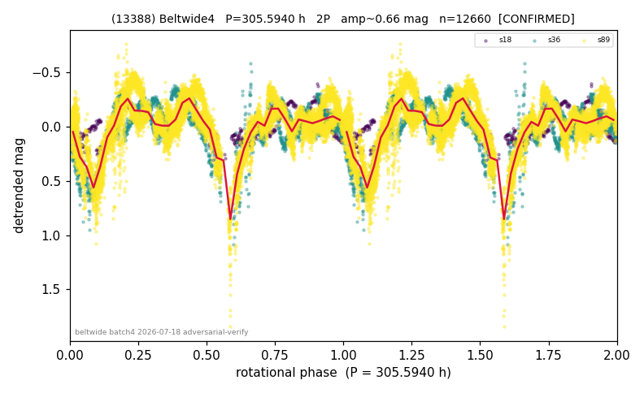

# (13388)

**Adopted:** 305.594 h, 2P, CONFIRMED

<!-- AUTO:START (regenerated from pipeline outputs; do not hand-edit this block) -->
## Evidence (auto)

Detected in 3 sector(s):

| sector | N | baseline (h) | P_phot (h) | power | FAP | cycles | flags |
|--|--|--|--|--|--|--|--|
| s18 | 572 | 490.5 | 152.7974 | 0.4778 | 1.4e-76 | 3.2 | 2P-untestable,2P-ambiguous |
| s36 | 2655 | 577.8 | 153.6989 | 0.3518 | 4.4e-245 | 3.8 | star-cleaned:8,2P-untestable,2P-ambiguou |
| s89 | 9470 | 673.3 | 75.6389 | 0.3612 | 0.0e+00 | 4.5 | star-cleaned:15 |

- Pipeline refine said: **2P** (folded amp_fourier 0.497); flags: few-cycle:2.2;gap-alias-risk:107h;sick-dips-excised:s36(21),s89(16);period-spread:61%
- DIA (de-comb): survived(dPW=-12%,R2=0.08,s18@152.797h,8sec)
- Coverage: **3 sector(s)**, best sector covers **2.2 cycles** of the adopted period. Measured periodogram peak width 20% of the period, i.e. about **+/- 13.15 h** (1 sigma); the decimal places in the adopted value are not a precision claim.
- Factor of two: **adopted on the amplitude convention**: standard practice for an elongated body, but a convention rather than a measurement.
- Gates: FAP<1e-3 and power>=0.10 per detecting sector; >=2 sectors agree (harmonic-aware).
- Adopted shape: **2P** (folded-amplitude rule; pipeline agrees).

### Why this row reads the way it does

- SUPER-SLOW #3 (3-sector S18/36/89, comb-free, 2P). Error-weighted LS and PDM independently recover the same ~152-154h base period in all 3 sectors: LS gives S18=; P_sid=307.0h Theta=0.404 SUPER-SLOW#3 sidereally confirmed (5.35yr, beats comb)
- doubling BY CONVENTION: folded amplitude 0.497 mag, above the 0.40 amplitude rule; the doubling was not separately demonstrated (recorded 2026-08-05, same provenance audit). Note this object's earlier deep-dip binary interpretation was retracted 2026-07-30

<!-- AUTO:END -->

## Reasoning
SUPER-SLOW #3, 3 sectors (S18/36/89) comb-free, base ~152-154 h in all three; sidereal P_sid=307.0 h, PDM Theta<=0.47. Refine wanted 153 h (1P); sidereal resolves to 305.6 h (2P).
## Verdict
CONFIRMED 2P / 305.594 h.

## Mutual-event candidate (2026-07-19, unconfirmed, reported)
Deep review of the "big dip" in the published fold found it is NOT contamination:
the fold contains narrow (5-8% of the period at half depth), deep (0.66-0.81 mag),
smooth minima recurring at the base period (152.8 h = P/2, two per system period),
phase-locked within each sector (chance ~1e-3), present in the 2020 and 2025
apparitions and absent in 2019 (aspect-dependent), with depths at the 0.75 mag
equal-pair ceiling. Same-star recrossing, bright-star proximity, and TESS-orbit
systematics were tested and excluded (Horizons + TIC control). These properties
match mutual events of a fully synchronous binary with system period ~305.6 h,
which would be record-class; they are inconsistent with ellipsoidal shape minima
(which would be 20-25% of P wide). UNCONFIRMED: an extreme contact/bilobed shape
is not fully excluded. The adopted 305.594 h is the photometric system period under
either reading and is unaffected. Full evidence: RESULTS_13388_BINARY_CANDIDATE.md
(working dir). Follow-up: event-timing ephemeris, ZTF archival, targeted ground
photometry at predicted events (~0.7 mag, V~16, amateur-reachable).
