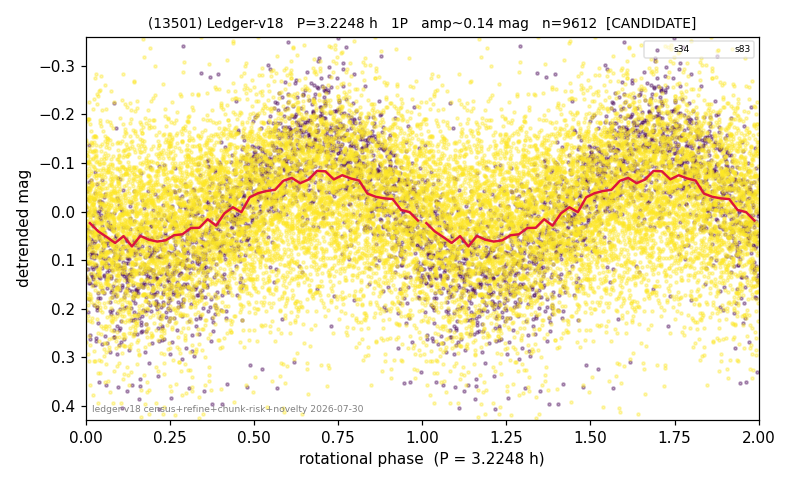

# (13501)

**Adopted:** 6.4496 h, 2P, CANDIDATE

<!-- AUTO:START (regenerated from pipeline outputs; do not hand-edit this block) -->
## Evidence (auto)

Detected in 2 sector(s):

| sector | N | baseline (h) | P_phot (h) | power | FAP | cycles | flags |
|--|--|--|--|--|--|--|--|
| s34 | 1940 | 413.7 | 3.2248 | 0.4963 | 5.1e-284 | 128.3 | star-cleaned:13,2P-ambiguous |
| s83 | 7687 | 527.8 | 3.2252 | 0.0729 | 1.7e-121 | 163.6 | star-cleaned:2 |

- Pipeline refine said: **1P** (folded amp_fourier 0.291); flags: sick-dips-excised:s34(1)
- DIA (de-comb): survived(dPW=+1%,R2=0.14,s34@3.225h,3sec)
- Gates: FAP<1e-3 and power>=0.10 per detecting sector; single strong sector (candidate ceiling).
- **Adopted shape 2P OVERRIDES the pipeline's 1P** (doubling audit 2026-07-25: folded amplitude >= 0.25 mag, so a single-peaked curve is physically implausible; Harris convention -> 2P. The census 3-test doubling logic was measured at only 30% recall against 289 LCDB U>=2 ground-truth periods).

### Why this row reads the way it does

- 1 sector(s) detecting
- single-peaked at folded amp 0.291 mag
- CORRECTED 3.2248->6.4496 h (2026-08-02 full 1P re-audit): doubling MEASURED at odd-harmonic 11.9 sigma with ALL detecting sectors significant (2/2); threshold odd>=8+full-reproduction calibrated to 0/60 false fires on the 4P null test (the minima-asymmetry branch alone fired falsely at z up to 34 and is not accepted)

<!-- AUTO:END -->
