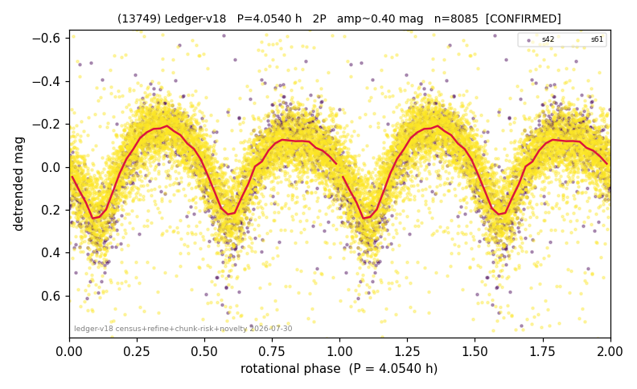

# (13749)

**Adopted:** 4.054 h, 2P, CONFIRMED

<!-- AUTO:START (regenerated from pipeline outputs; do not hand-edit this block) -->
## Evidence (auto)

Detected in 2 sector(s):

| sector | N | baseline (h) | P_phot (h) | power | FAP | cycles | flags |
|--|--|--|--|--|--|--|--|
| s42 | 1606 | 299.3 | 2.0272 | 0.6825 | 0.0e+00 | 147.7 | star-cleaned:4,2P-ambiguous |
| s61 | 6557 | 505.3 | 2.0275 | 0.4337 | 0.0e+00 | 249.2 | star-cleaned:91,2P-ambiguous |

- Pipeline refine said: **2P** (folded amp_fourier 0.449); flags: sick-dips-excised:s42(8),s61(69);near-threshold:0.45
- DIA (de-comb): **NOT RUN for this lot.** No de-comb verdict exists for this object, so momentum-dump contamination has not been excluded by that test here.
- Gates: FAP<1e-3 and power>=0.10 per detecting sector; >=2 sectors agree (harmonic-aware).
- Adopted shape: **2P** (folded-amplitude rule; pipeline agrees).

### Why this row reads the way it does

- 2 sector(s) detecting
- cross-sector fold correlation 0.99
- doubling BY CONVENTION: amplitude rule on folded amp 0.449 mag, not individually audited

<!-- AUTO:END -->
