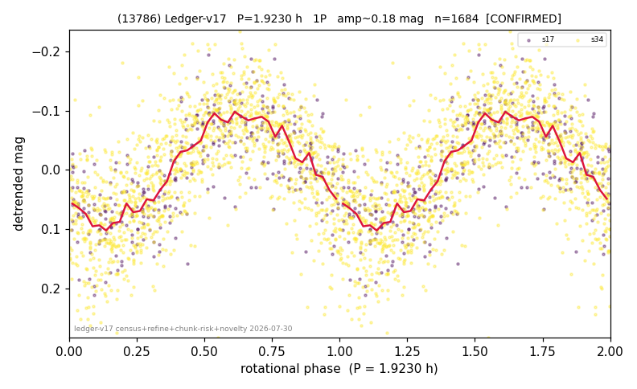

# (13786)

**Adopted:** 3.846 h, 2P, CONFIRMED

<!-- AUTO:START (regenerated from pipeline outputs; do not hand-edit this block) -->
## Evidence (auto)

Detected in 2 sector(s):

| sector | N | baseline (h) | P_phot (h) | power | FAP | cycles | flags |
|--|--|--|--|--|--|--|--|
| s17 | 332 | 367.0 | 1.9232 | 0.5873 | 5.8e-60 | 190.8 | 2P-ambiguous |
| s34 | 1354 | 372.7 | 1.9236 | 0.5191 | 1.5e-210 | 193.7 | star-cleaned:15,2P-ambiguous |

- Pipeline refine said: **1P** (folded amp_fourier 0.201); flags: sick-dips-excised:s34(1)
- DIA (de-comb): survived(dPW=+6%,R2=0.16,s17@1.923h,2sec)
- Coverage: **3 sector(s)**, best sector covers **157.35 cycles** of the adopted period. Measured periodogram peak width 0% of the period, i.e. about **+/- 0.003002 h** (1 sigma); the decimal places in the adopted value are not a precision claim.
- Factor of two: **measured on the data** (odd-harmonic power or unequal minima, significant and reproduced), METHODOLOGY 3b.
- Gates: FAP<1e-3 and power>=0.10 per detecting sector; >=2 sectors agree (harmonic-aware).
- **Adopted shape 2P OVERRIDES the pipeline's 1P** (doubling audit 2026-07-25: folded amplitude >= 0.25 mag, so a single-peaked curve is physically implausible; Harris convention -> 2P. The census 3-test doubling logic was measured at only 30% recall against 289 LCDB U>=2 ground-truth periods).

### Why this row reads the way it does

- 2 sector(s) detecting
- cross-sector fold correlation 0.93
- single-peaked at folded amp 0.201 mag
- CORRECTED 1.923->3.8460 h (2026-08-01 sub-barrier sweep): all 49 catalog periods below 2.2 h sat on 5-16 km bodies, impossible as true rotations; doubling MEASURED in the 2026-08-01 fast-rotator re-audit: odd-harmonic 6.43 sigma (2/2 sectors), minima z=2.94
- s87 crowding-rescued (2026-08-08, |b| 5-15 deg rescue, 5-point crowding penalty, 72 vs 77 per cent LCDB agreement): power 0.10, FAP 3.1e-191 at the adopted photometric period, 157.3 cycles, chunk-extracted

<!-- AUTO:END -->
