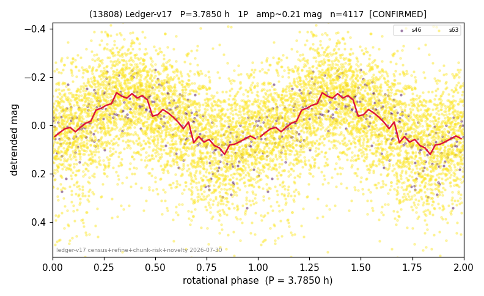

# (13808)

**Adopted:** 7.57 h, 2P, CONFIRMED

<!-- AUTO:START (regenerated from pipeline outputs; do not hand-edit this block) -->
## Evidence (auto)

Detected in 2 sector(s):

| sector | N | baseline (h) | P_phot (h) | power | FAP | cycles | flags |
|--|--|--|--|--|--|--|--|
| s46 | 250 | 51.0 | 3.7849 | 0.5005 | 4.7e-34 | 13.5 | 2P-ambiguous |
| s63 | 3882 | 273.4 | 3.7859 | 0.1811 | 1.1e-163 | 72.2 | star-cleaned:44,2P-ambiguous |

- Pipeline refine said: **1P** (folded amp_fourier 0.261); flags: sick-dips-excised:s63(2)
- DIA (de-comb): inconclusive(dPW=+17%,R2=0.10,s46@3.785h)
- Coverage: **1 sector(s)**, best sector covers **36.11 cycles** of the adopted period. Measured periodogram peak width 1% of the period, i.e. about **+/- 0.02 h** (1 sigma); the decimal places in the adopted value are not a precision claim.
- Factor of two: **measured on the data** (odd-harmonic power or unequal minima, significant and reproduced), METHODOLOGY 3b.
- Gates: FAP<1e-3 and power>=0.10 per detecting sector; >=2 sectors agree (harmonic-aware).
- **Adopted shape 2P OVERRIDES the pipeline's 1P** (doubling audit 2026-07-25: folded amplitude >= 0.25 mag, so a single-peaked curve is physically implausible; Harris convention -> 2P. The census 3-test doubling logic was measured at only 30% recall against 289 LCDB U>=2 ground-truth periods).

### Why this row reads the way it does

- 2 sector(s) detecting
- cross-sector fold correlation 0.85
- single-peaked at folded amp 0.261 mag
- CORRECTED 3.785->7.5700 h (2026-08-02 full 1P re-audit): doubling MEASURED at odd-harmonic 8.3 sigma with ALL detecting sectors significant (2/2); threshold odd>=8+full-reproduction calibrated to 0/60 false fires on the 4P null test (the minima-asymmetry branch alone fired falsely at z up to 34 and is not accepted)

<!-- AUTO:END -->
