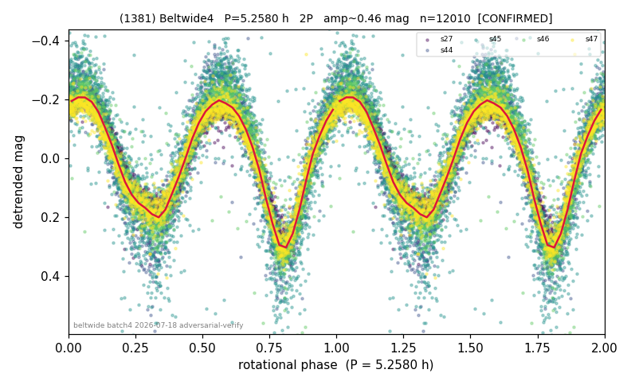

# (1381)

**Adopted:** 5.258 h, 2P, CONFIRMED

<!-- AUTO:START (regenerated from pipeline outputs; do not hand-edit this block) -->
## Evidence (auto)

Detected in 5 sector(s):

| sector | N | baseline (h) | P_phot (h) | power | FAP | cycles | flags |
|--|--|--|--|--|--|--|--|
| s27 | 2653 | 578.7 | 2.6297 | 0.8904 | 0.0e+00 | 220.0 | 2P-ambiguous |
| s44 | 1128 | 367.5 | 2.6286 | 0.8425 | 0.0e+00 | 139.8 | star-cleaned:3,2P-ambiguous |
| s45 | 2473 | 588.9 | 2.6278 | 0.6506 | 0.0e+00 | 224.1 | star-cleaned:2,2P-ambiguous |
| s46 | 3170 | 630.4 | 2.6293 | 0.8782 | 0.0e+00 | 239.7 | 2P-ambiguous |
| s47 | 2601 | 607.8 | 2.629 | 0.9001 | 0.0e+00 | 231.2 | 2P-ambiguous |

- Pipeline refine said: **2P** (folded amp_fourier 0.594); flags: sick-dips-excised:s45(4),s46(1)
- DIA (de-comb): survived(dPW=+3%,R2=0.08,s27@2.629h,4sec)
- Coverage: **5 sector(s)**, best sector covers **119.89 cycles** of the adopted period. Measured periodogram peak width 0% of the period, i.e. about **+/- 0.0 h** (1 sigma); the decimal places in the adopted value are not a precision claim.
- Factor of two: **not stated**, which is a defect in this entry.
- Gates: FAP<1e-3 and power>=0.10 per detecting sector; >=2 sectors agree (harmonic-aware).
- Adopted shape: **2P** (folded-amplitude rule; pipeline agrees).

### Why this row reads the way it does

- All 5 sectors independently recover the same base period P=2.6291 h via two independent methods (error-weighted LS, power 0.67-0.91, FAP~0; and Stelli

<!-- AUTO:END -->
