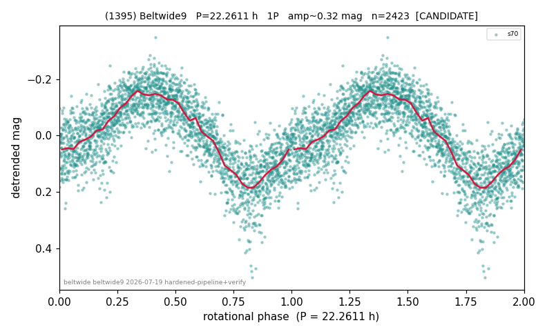

# (1395)

**Adopted:** 22.2611 h, 1P, CANDIDATE

<!-- AUTO:START (regenerated from pipeline outputs; do not hand-edit this block) -->
## Evidence (auto)

Detected in 1 sector(s):

| sector | N | baseline (h) | P_phot (h) | power | FAP | cycles | flags |
|--|--|--|--|--|--|--|--|
| s70 | 2423 | 144.6 | 22.2611 | 0.6639 | 0.0e+00 | 6.5 | 2P-ambiguous |

- Refined shape: **1P** (folded amp_fourier 0.319); flags: near-comb(amp-cleared):n=15;few-cycle:3.2
- DIA (de-comb): survived(dPW=+1%,R2=0.03,s70@22.261h,3sec)
- Gates: FAP<1e-3 and power>=0.10 per detecting sector; single strong sector (candidate ceiling); folded-amplitude rule -> 1P.

<!-- AUTO:END -->
