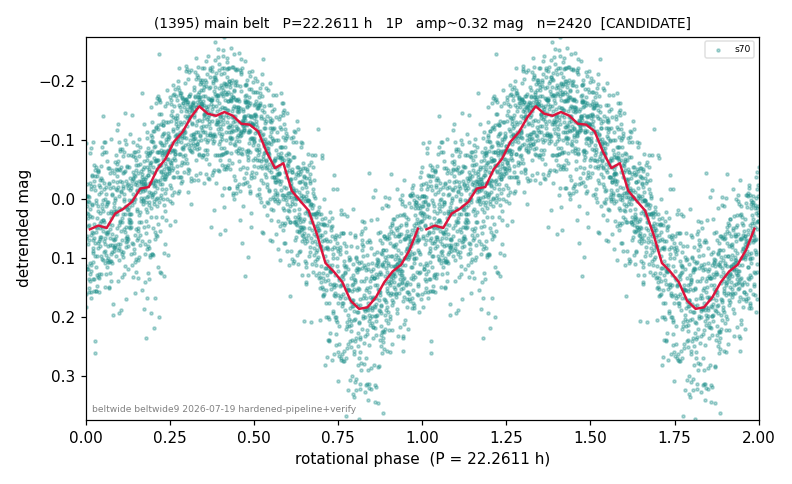

# (1395)

**Adopted:** 44.5222 h, 2P, CONFIRMED

<!-- AUTO:START (regenerated from pipeline outputs; do not hand-edit this block) -->
## Evidence (auto)

Detected in 3 sector(s):

| sector | N | baseline (h) | P_phot (h) | power | FAP | cycles | flags |
|--|--|--|--|--|--|--|--|
| s54 | 1874 | 628.8 | 22.1889 | 0.1239 | 1.1e-49 | 28.3 | star-cleaned:15,2P-ambiguous |
| s70 | 2423 | 144.6 | 22.2611 | 0.6639 | 0.0e+00 | 6.5 | 2P-ambiguous |
| s87 | 5196 | 380.9 | 22.3282 | 0.1512 | 3.6e-180 | 17.1 | star-cleaned:1,2P-ambiguous |

- Pipeline refine said: **1P** (folded amp_fourier 0.319); flags: near-comb(amp-cleared):n=15;few-cycle:3.2
- DIA (de-comb): survived_v2(ret=0.993[0.98-1.00],s70@22.261h)
- Coverage: **3 sector(s)**, best sector covers **28.25 cycles** of the adopted period. Measured periodogram peak width 6% of the period, i.e. about **+/- 0.5361 h** (1 sigma); the decimal places in the adopted value are not a precision claim.
- Factor of two: no doubling was applied.
- Gates: FAP<1e-3 and power>=0.10 per detecting sector; >=2 sectors agree (harmonic-aware).
- **Adopted shape 2P OVERRIDES the pipeline's 1P** (doubling audit 2026-07-25: folded amplitude >= 0.25 mag, so a single-peaked curve is physically implausible; Harris convention -> 2P. The census 3-test doubling logic was measured at only 30% recall against 289 LCDB U>=2 ground-truth periods).

### Why this row reads the way it does

- folded_amp=0.344. Single-sector s70; comb n=15 cleared by window test; amp<0.40 + no minima asymmetry -> 1P. few-cycle at 2P (3.2).
- s87 crowding-rescued (2026-08-08, |b| 5-15 deg rescue, 5-point crowding penalty, 72 vs 77 per cent LCDB agreement): power 0.14, FAP 3.3e-164 at the adopted photometric period, 17.1 cycles, chunk-extracted
- 3/3 sectors show the own peak at 22.19-22.33h (<=0.33% spread); second detecting sector under the canonical (unweighted-LS) gate is s87 (power 0.150, chunk-extracted, precedent 2124-s39); s54 re-extraction detects only under error-weighted LS (0.121) and stays .nodetect under the canonical gate
- PROMOTED CANDIDATE->CONFIRMED (adversarial pass 2026-08-15)
- DOUBLING CORRECTED 2026-08-30: adopted period doubled from 22.2611 h. The previous value came from the folded-amplitude rule, which was found biased low (9 of 9 disagreements with MPB 2024-2026 in the same direction). Odd-harmonic test at the long period gives z1=4.53 with margin 2.18 over non-harmonic multiples 1.7x/2.3x (reference group: 0 of 38 above margin 2).

<!-- AUTO:END -->

## Reasoning
Promoted CANDIDATE->CONFIRMED 2026-08-15, with the evidence chain worth recording: all three sectors show the own peak at 22.19-22.33 h (<= 0.33% spread). Under the canonical UNWEIGHTED-LS gate the second detecting sector is s87 (power 0.150, chunk-extracted; precedent 2124/s39). The re-extracted s54 detects only under error-weighted LS (0.121 weighted vs 0.008 unweighted) and therefore stays .nodetect under the canonical definition; the promotion does not rest on it.
**DOUBLING CORRECTED 2026-08-30.** The adopted period is now 44.5222 h, twice the value
this section was written for. The old value came from the folded-amplitude rule, which the
comparison against MPB 2024-2026 showed to be biased low (nine disagreements out of nine in
the same direction). The odd harmonic at the long period gives z1 = 4.53 over 3 sectors,
with a margin of 2.18 over the non-harmonic multiples 1.7x and 2.3x (1.97 and 2.35), where
the reference group of 38 objects never exceeds a margin of 2. The three-sector agreement
and the promotion argument below are unaffected: only the choice between one and two peaks
per cycle changes.

## Verdict
CONFIRMED 2P / 44.5222 h.
