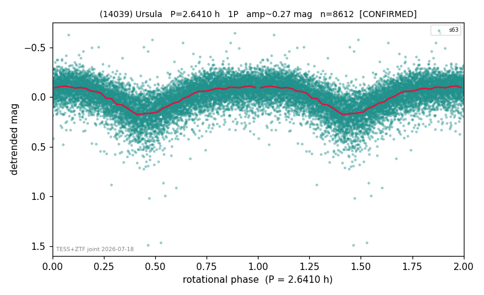

# (14039)

**Adopted:** 2.641 h, 1P, CONFIRMED

<!-- AUTO:START (regenerated from pipeline outputs; do not hand-edit this block) -->
## Evidence (auto)

Detected in 1 sector(s):

| sector | N | baseline (h) | P_phot (h) | power | FAP | cycles | flags |
|--|--|--|--|--|--|--|--|
| s63 | 8612 | 612.1 | 2.642 | 0.3377 | 0.0e+00 | 231.7 | star-cleaned:136,2P-ambiguous |

- Refined shape: **1P** (folded amp_fourier 0.278); flags: sick-dips-excised:s63(7)
- DIA (de-comb): survived(dPW=+0%,R2=0.01,s63@2.642h,3sec)
- Gates: FAP<1e-3 and power>=0.10 per detecting sector; >=2 sectors agree (harmonic-aware); folded-amplitude rule -> 1P.

<!-- AUTO:END -->
