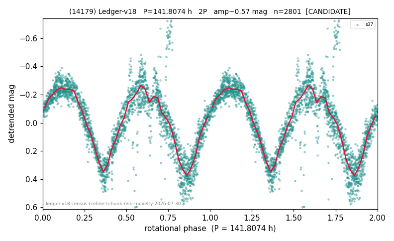

# (14179)

**Adopted:** 141.8074 h, 2P, CANDIDATE

<!-- AUTO:START (regenerated from pipeline outputs; do not hand-edit this block) -->
## Evidence (auto)

Detected in 1 sector(s):

| sector | N | baseline (h) | P_phot (h) | power | FAP | cycles | flags |
|--|--|--|--|--|--|--|--|
| s37 | 2825 | 601.2 | 70.9037 | 0.7399 | 0.0e+00 | 8.5 | star-cleaned:3,2P-ambiguous |

- Pipeline refine said: **2P** (folded amp_fourier 0.57); flags: sick-dips-excised:s37(12)
- DIA (de-comb): survived(dPW=+2%,R2=0.24,s37@70.904h,2sec)
- Gates: FAP<1e-3 and power>=0.10 per detecting sector; single strong sector (candidate ceiling).
- Adopted shape: **2P** (folded-amplitude rule; pipeline agrees).

### Why this row reads the way it does

- 1 sector(s) detecting
- doubling BY CONVENTION: symmetric fold at 0.63 mag amplitude

<!-- AUTO:END -->
