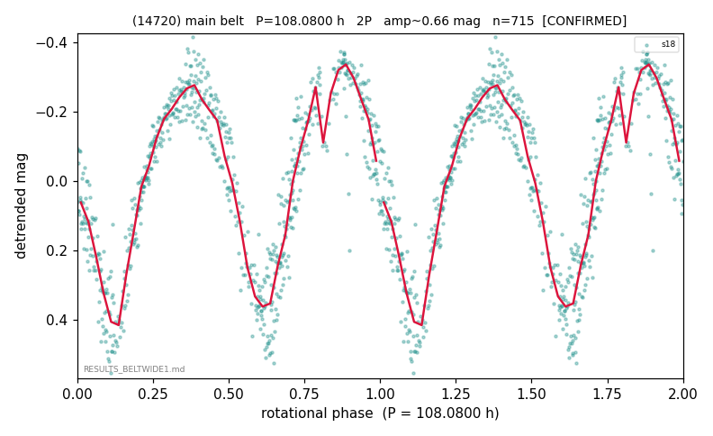

# (14720)

**Adopted:** 108.08 h, 2P, CONFIRMED

<!-- AUTO:START (regenerated from pipeline outputs; do not hand-edit this block) -->
## Evidence (auto)

Detected in 1 sector(s):

| sector | N | baseline (h) | P_phot (h) | power | FAP | cycles | flags |
|--|--|--|--|--|--|--|--|
| s18 | 715 | 569.0 | 54.0387 | 0.8388 | 6.1e-278 | 10.5 | 2P-ambiguous |

- Pipeline refine said: **2P** (folded amp_fourier 0.676); flags: near-comb(amp-cleared):n=3,6;gap-alias-risk:107h
- DIA (de-comb): survived(dPW=+1%,R2=0.05,s18@54.039h,2sec)
- Gates: FAP<1e-3 and power>=0.10 per detecting sector; >=2 sectors agree (harmonic-aware).
- Adopted shape: **2P** (folded-amplitude rule; pipeline agrees).

### Why this row reads the way it does

- confirms Durech/Hanus 108.14h; gap-alias flag defused by external epoch

<!-- AUTO:END -->
