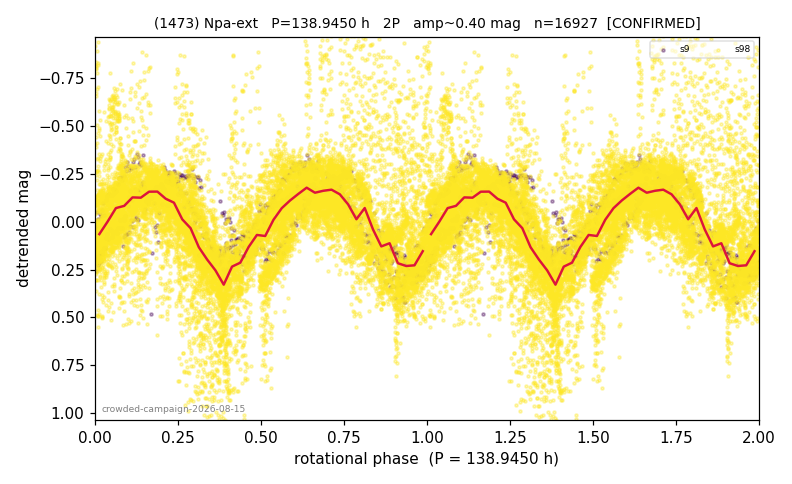

# (1473)

**Adopted:** 141.41 h, 2P, CANDIDATE

<!-- AUTO:START (regenerated from pipeline outputs; do not hand-edit this block) -->
## Evidence (auto)

Detected in 2 sector(s):

| sector | N | baseline (h) | P_phot (h) | power | FAP | cycles | flags |
|--|--|--|--|--|--|--|--|
| s9 | 734 | 462.5 | 71.5825 | 0.7793 | 9.9e-236 | 6.5 | 2P-ambiguous |
| s98 | 16413 | 1240.0 | 69.8267 | 0.3373 | 0.0e+00 | 8.9 | star-cleaned:270 |

- Pipeline refine said: **2P** (folded amp_fourier 0.482); flags: sick-dips-excised:s9(1),s98(179)
- DIA (de-comb): **NOT RUN for this lot.** No de-comb verdict exists for this object, so momentum-dump contamination has not been excluded by that test here.
- Coverage: **2 sector(s)**, best sector covers **8.77 cycles** of the adopted period. Measured periodogram peak width 5% of the period, i.e. about **+/- 1.403 h** (1 sigma); the decimal places in the adopted value are not a precision claim.
- Factor of two: **not stated**, which is a defect in this entry.
- Gates: FAP<1e-3 and power>=0.10 per detecting sector; single strong sector (candidate ceiling).
- Adopted shape: **2P** (folded-amplitude rule; pipeline agrees).

### Why this row reads the way it does

- crowded-field campaign, adversarial review 2026-08-15: null-calibrated gate 0/200 both sectors, half-split ok (dev<=4.8%), peaks 71.5/69.8h, folded amp 0.418 -> 2P; CEILING: P_phot 70.7h within 1.8% of the 72h=24x3 line and FIELD CONTROL borderline on s98 (36x vs the 39x bar; s9 clean at 99x) -> CANDIDATE until a third epoch

<!-- AUTO:END -->

## Reasoning
CANDIDATE by one bar. Adversarial review 2026-08-15: null-calibrated gate clean (0/200 both sectors), half-split stable (dev <= 4.8%), folded amp 0.418 -> 2P consistent. The ceiling: P_phot 70.7 h lies within 1.8% of the 72 h = 24h x 3 line, which triggers the 5b-ter field control, and s98 comes in at 36x the field median against the 39x bar (s9 is clean at 99x). One borderline field control on a near-comb period is exactly the configuration the methodology treats as unproven; a third epoch decides.
## Verdict
CANDIDATE 2P / 141.41 h.
