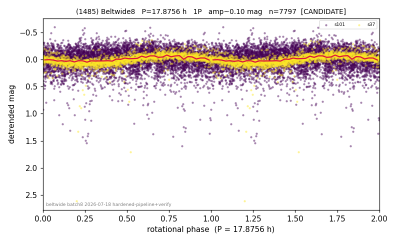

# (1485)

**Adopted:** 17.8756 h, 1P, CANDIDATE

<!-- AUTO:START (regenerated from pipeline outputs; do not hand-edit this block) -->
## Evidence (auto)

Detected in 2 sector(s):

| sector | N | baseline (h) | P_phot (h) | power | FAP | cycles | flags |
|--|--|--|--|--|--|--|--|
| s37 | 2273 | 487.0 | 17.8756 | 0.4566 | 4.2e-296 | 27.2 | 2P-ambiguous |
| s101 | 5524 | 367.7 | 18.0079 | 0.0216 | 6.5e-22 | 20.4 | clean |

- Gates: FAP<1e-3 and power>=0.10 per detecting sector; single strong sector (candidate ceiling); folded-amplitude rule -> 1P.

<!-- AUTO:END -->
