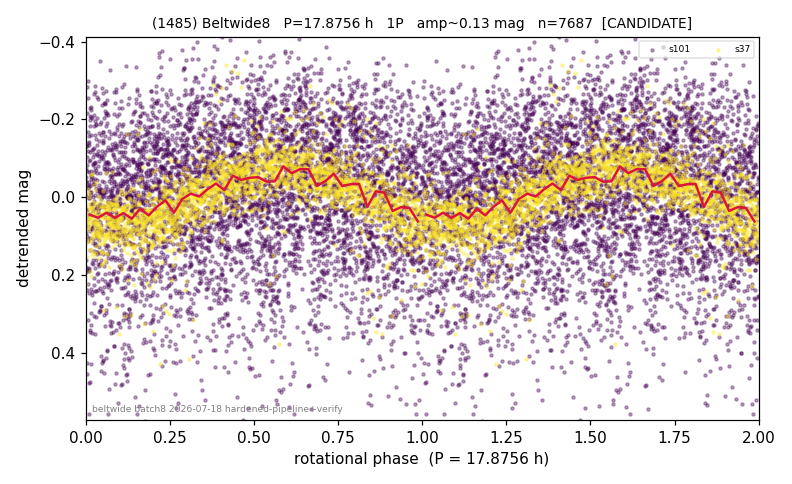

# (1485)

**Adopted:** 17.8756 h, 1P, CANDIDATE

<!-- AUTO:START (regenerated from pipeline outputs; do not hand-edit this block) -->
## Evidence (auto)

Detected in 2 sector(s):

| sector | N | baseline (h) | P_phot (h) | power | FAP | cycles | flags |
|--|--|--|--|--|--|--|--|
| s37 | 2273 | 487.0 | 17.8756 | 0.4566 | 4.2e-296 | 27.2 | 2P-ambiguous |
| s101 | 5524 | 367.7 | 18.0079 | 0.0216 | 6.5e-22 | 20.4 | clean |

- Pipeline refine said: **1P** (folded amp_fourier 0.162); flags: sick-dips-excised:s37(3)
- DIA (de-comb): survived_v2(ret=0.964[0.95-1.00],s37@17.876h)
- Coverage: **2 sector(s)**, best sector covers **27.24 cycles** of the adopted period. Measured periodogram peak width 3% of the period, i.e. about **+/- 0.2471 h** (1 sigma); the decimal places in the adopted value are not a precision claim.
- Factor of two: no doubling was applied.
- Gates: FAP<1e-3 and power>=0.10 per detecting sector; single strong sector (candidate ceiling).
- Adopted shape: **1P** (folded-amplitude rule; pipeline agrees).

### Why this row reads the way it does

- folded_amp=0.131. s37 independently confirms P=17.8756h at power 0.457/FAP 4.2e-296 (very strong, clean single-humped fold); s101's best peak (18.008h, close but power only 0.022, well below the DETECT_POWER=0.10 floor) is too weak to cou

<!-- AUTO:END -->
