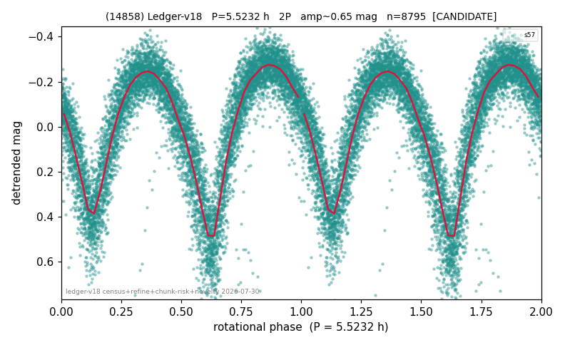

# (14858)

**Adopted:** 5.5232 h, 2P, CANDIDATE

<!-- AUTO:START (regenerated from pipeline outputs; do not hand-edit this block) -->
## Evidence (auto)

Detected in 1 sector(s):

| sector | N | baseline (h) | P_phot (h) | power | FAP | cycles | flags |
|--|--|--|--|--|--|--|--|
| s57 | 8813 | 672.9 | 2.7616 | 0.74 | 0.0e+00 | 121.8 | clean |

- Pipeline refine said: **2P** (folded amp_fourier 0.69); flags: sick-dips-excised:s57(9)
- DIA (de-comb): survived(dPW=-0%,R2=0.01,s57@2.762h,3sec)
- Gates: FAP<1e-3 and power>=0.10 per detecting sector; single strong sector (candidate ceiling).
- Adopted shape: **2P** (folded-amplitude rule; pipeline agrees).

### Why this row reads the way it does

- 1 sector(s) detecting
- doubling BY CONVENTION: amplitude rule on folded amp 0.690 mag, not individually audited

<!-- AUTO:END -->
