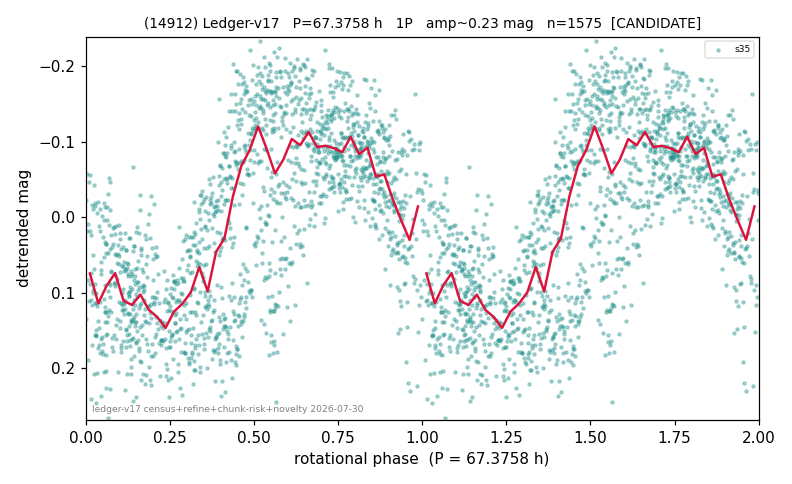

# (14912)

**Adopted:** 67.3758 h, 1P, CANDIDATE

<!-- AUTO:START (regenerated from pipeline outputs; do not hand-edit this block) -->
## Evidence (auto)

Detected in 1 sector(s):

| sector | N | baseline (h) | P_phot (h) | power | FAP | cycles | flags |
|--|--|--|--|--|--|--|--|
| s35 | 1578 | 452.8 | 67.3758 | 0.4861 | 2.5e-223 | 6.7 | 2P-ambiguous |

- Pipeline refine said: **1P** (folded amp_fourier 0.268); flags: dump-alias-suspect:n=5;few-cycle:3.4;gap-alias-risk:122h;sick-dips-excised:s35(1)
- DIA (de-comb): not triggered (clean, fast, non-comb)
- Gates: FAP<1e-3 and power>=0.10 per detecting sector; single strong sector (candidate ceiling).
- Adopted shape: **1P** (folded-amplitude rule; pipeline agrees).

### Why this row reads the way it does

- 1 sector(s) detecting
- single-peaked at folded amp 0.268 mag
- pipeline flag: dump-alias-suspect
- pipeline flag: few-cycle

<!-- AUTO:END -->
