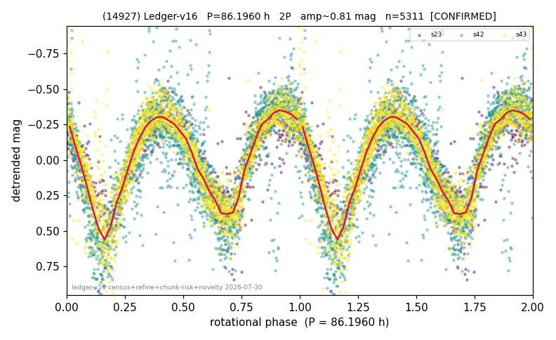

# (14927)

**Adopted:** 86.196 h, 2P, CONFIRMED

<!-- AUTO:START (regenerated from pipeline outputs; do not hand-edit this block) -->
## Evidence (auto)

Detected in 3 sector(s):

| sector | N | baseline (h) | P_phot (h) | power | FAP | cycles | flags |
|--|--|--|--|--|--|--|--|
| s23 | 658 | 593.0 | 43.0187 | 0.586 | 1.7e-121 | 13.8 | 2P-ambiguous |
| s42 | 2268 | 438.5 | 43.0977 | 0.6629 | 0.0e+00 | 10.2 | star-cleaned:11,2P-ambiguous |
| s43 | 2413 | 570.0 | 43.1231 | 0.8083 | 0.0e+00 | 13.2 | star-cleaned:25,2P-ambiguous |

- Pipeline refine said: **2P** (folded amp_fourier 0.872); flags: gap-alias-risk:149h;sick-dips-excised:s23(2),s42(17),s43(5)
- DIA (de-comb): survived(dPW=+15%,R2=0.21,s43@43.098h,4sec)
- Coverage: **3 sector(s)**, best sector covers **6.88 cycles** of the adopted period. Measured periodogram peak width 6% of the period, i.e. about **+/- 1.05 h** (1 sigma); the decimal places in the adopted value are not a precision claim.
- Factor of two: **adopted on the amplitude convention**: standard practice for an elongated body, but a convention rather than a measurement.
- Gates: FAP<1e-3 and power>=0.10 per detecting sector; >=2 sectors agree (harmonic-aware).
- Adopted shape: **2P** (folded-amplitude rule; pipeline agrees).

### Why this row reads the way it does

- 3 sector(s) detecting
- cross-sector fold correlation 0.96
- doubling BY CONVENTION: amplitude rule on folded amp 0.872 mag, not individually audited

<!-- AUTO:END -->
