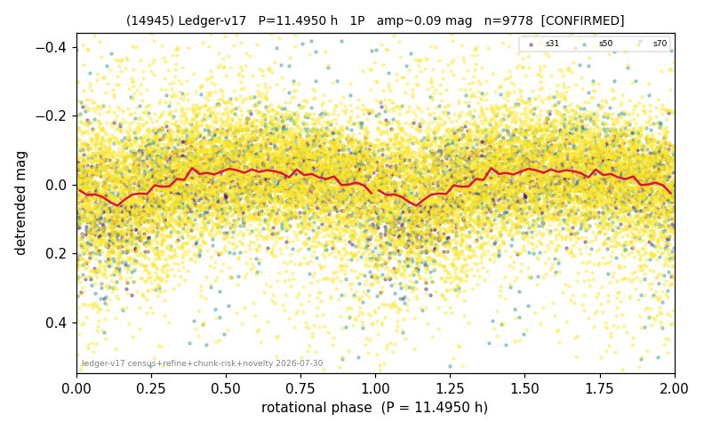

# (14945)

**Adopted:** 11.495 h, 1P, CONFIRMED

<!-- AUTO:START (regenerated from pipeline outputs; do not hand-edit this block) -->
## Evidence (auto)

Detected in 3 sector(s):

| sector | N | baseline (h) | P_phot (h) | power | FAP | cycles | flags |
|--|--|--|--|--|--|--|--|
| s31 | 1341 | 264.3 | 11.5973 | 0.1515 | 7.2e-44 | 22.8 | 2P-ambiguous |
| s50 | 1199 | 300.7 | 11.3926 | 0.1154 | 3.5e-28 | 26.4 | star-cleaned:11,2P-ambiguous |
| s70 | 7337 | 539.6 | 11.5696 | 0.0265 | 3.1e-38 | 46.6 | star-cleaned:366 |

- Pipeline refine said: **1P** (folded amp_fourier 0.138); flags: sick-dips-excised:s50(4);harmonic-only-agreement:s50(pw=0.08)
- DIA (de-comb): not triggered (clean, fast, non-comb)
- Gates: FAP<1e-3 and power>=0.10 per detecting sector; >=2 sectors agree (harmonic-aware).
- Adopted shape: **1P** (folded-amplitude rule; pipeline agrees).

### Why this row reads the way it does

- 2 sector(s) detecting
- cross-sector fold correlation 0.82
- single-peaked at folded amp 0.138 mag
- pipeline flag: harmonic-only-agreement

<!-- AUTO:END -->
