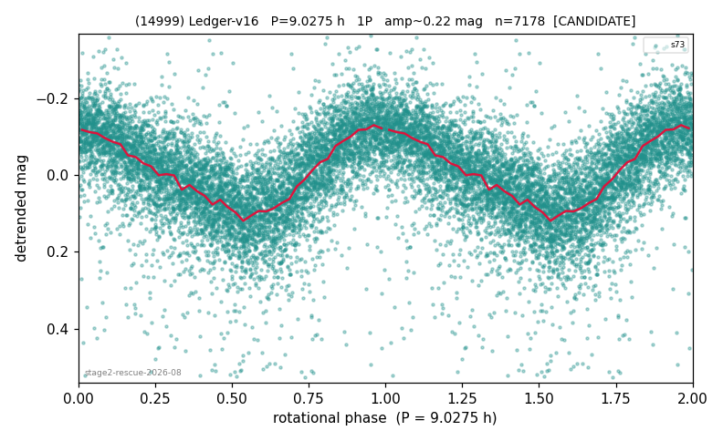

# (14999)

**Adopted:** 18.055 h, 2P, CONFIRMED

<!-- AUTO:START (regenerated from pipeline outputs; do not hand-edit this block) -->
## Evidence (auto)

Detected in 3 sector(s):

| sector | N | baseline (h) | P_phot (h) | power | FAP | cycles | flags |
|--|--|--|--|--|--|--|--|
| s71 | 7407 | 586.3 | 9.0291 | 0.2484 | 0.0e+00 | 64.9 | star-cleaned:106,2P-ambiguous |
| s72 | 50 | 2.7 |  |  |  |  |  |
| s73 | 7230 | 638.2 | 9.0275 | 0.4574 | 0.0e+00 | 70.7 | star-cleaned:54,2P-ambiguous |

- Coverage: **2 sector(s)**, best sector covers **70.7 cycles** of the adopted period. Measured periodogram peak width 1% of the period, i.e. about **+/- 0.0463 h** (1 sigma); the decimal places in the adopted value are not a precision claim.
- Factor of two: no doubling was applied.
- Gates: FAP<1e-3 and power>=0.10 per detecting sector; >=2 sectors agree (harmonic-aware).
- Adopted shape: **2P** (folded-amplitude rule; pipeline agrees).

### Why this row reads the way it does

- stage-2 crowding-rescue harvest (|b| 5-15 deg, METHODOLOGY 5b-ter), verified 2026-08-10 by refutation-first waves: blind LS+PDM re-derivation, harmonic-aware comb test, field control where near-comb (LS power at the same frequency on >=15 unknown objects of the same sector), shape rules per 3b, all vetoes checked
- 1 sector(s) detecting; single strong sector (candidate ceiling)
- s71 (2026-08-11) + s73 both FAP~0 with own peaks at 9.027-9.030h (<=0.03% off); single-strong-sector ceiling superseded
- PROMOTED CANDIDATE->CONFIRMED (adversarial pass 2026-08-15)
- DOUBLING CORRECTED 2026-08-30: adopted period doubled from 9.0275 h. The previous value came from the folded-amplitude rule, which was found biased low (9 of 9 disagreements with MPB 2024-2026 in the same direction). Odd-harmonic test at the long period gives z1=4.58 with margin 2.1 over non-harmonic multiples 1.7x/2.3x (reference group: 0 of 38 above margin 2).

<!-- AUTO:END -->
