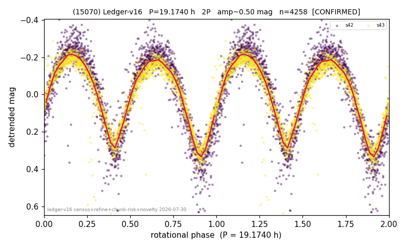

# (15070)

**Adopted:** 19.174 h, 2P, CONFIRMED

<!-- AUTO:START (regenerated from pipeline outputs; do not hand-edit this block) -->
## Evidence (auto)

Detected in 2 sector(s):

| sector | N | baseline (h) | P_phot (h) | power | FAP | cycles | flags |
|--|--|--|--|--|--|--|--|
| s42 | 2207 | 567.5 | 9.5869 | 0.8301 | 0.0e+00 | 59.2 | star-cleaned:8,2P-ambiguous |
| s43 | 2081 | 589.5 | 9.5865 | 0.7956 | 0.0e+00 | 61.5 | star-cleaned:14,2P-ambiguous |

- Pipeline refine said: **2P** (folded amp_fourier 0.597); flags: sick-dips-excised:s42(4),s43(2)
- DIA (de-comb): survived(dPW=+5%,R2=0.53,s42@9.587h,4sec)
- Coverage: **2 sector(s)**, best sector covers **30.74 cycles** of the adopted period. Measured periodogram peak width 1% of the period, i.e. about **+/- 0.05344 h** (1 sigma); the decimal places in the adopted value are not a precision claim.
- Factor of two: **adopted on the amplitude convention**: standard practice for an elongated body, but a convention rather than a measurement.
- Gates: FAP<1e-3 and power>=0.10 per detecting sector; >=2 sectors agree (harmonic-aware).
- Adopted shape: **2P** (folded-amplitude rule; pipeline agrees).

### Why this row reads the way it does

- 2 sector(s) detecting
- cross-sector fold correlation 0.99
- doubling BY CONVENTION: amplitude rule on folded amp 0.597 mag, not individually audited

<!-- AUTO:END -->
