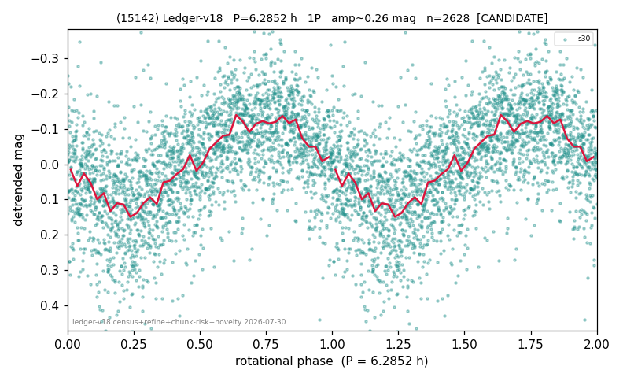

# (15142)

**Adopted:** 6.2852 h, 1P, CANDIDATE

<!-- AUTO:START (regenerated from pipeline outputs; do not hand-edit this block) -->
## Evidence (auto)

Detected in 1 sector(s):

| sector | N | baseline (h) | P_phot (h) | power | FAP | cycles | flags |
|--|--|--|--|--|--|--|--|
| s30 | 2631 | 634.0 | 6.2852 | 0.38 | 3.3e-268 | 100.9 | star-cleaned:24,2P-ambiguous |

- Pipeline refine said: **1P** (folded amp_fourier 0.259); flags: clean
- DIA (de-comb): not triggered (the object is clean, fast and non-comb, so the test does not apply)
- Gates: FAP<1e-3 and power>=0.10 per detecting sector; single strong sector (candidate ceiling).
- Adopted shape: **1P** (folded-amplitude rule; pipeline agrees).

### Why this row reads the way it does

- 1 sector(s) detecting
- single-peaked at folded amp 0.259 mag

<!-- AUTO:END -->
