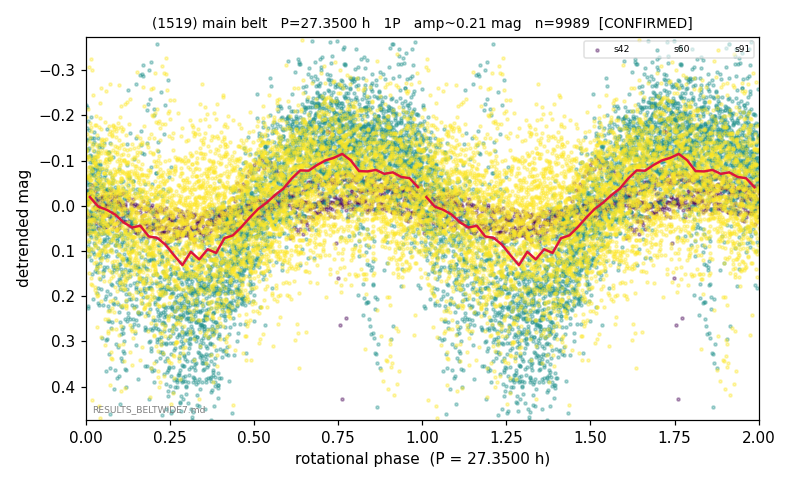

# (1519)

**Adopted:** 27.35 h, 1P, CONFIRMED

<!-- AUTO:START (regenerated from pipeline outputs; do not hand-edit this block) -->
## Evidence (auto)

Detected in 3 sector(s):

| sector | N | baseline (h) | P_phot (h) | power | FAP | cycles | flags |
|--|--|--|--|--|--|--|--|
| s42 | 905 | 206.7 | 26.5399 | 0.2927 | 3.9e-64 | 7.8 | clean |
| s60 | 3822 | 277.7 | 27.3504 | 0.6057 | 0.0e+00 | 10.2 | star-cleaned:11,2P-ambiguous |
| s91 | 5321 | 483.1 | 27.5633 | 0.1768 | 7.9e-220 | 17.5 | star-cleaned:5,2P-ambiguous |

- Refined shape: **1P** (folded amp_fourier 0.392); flags: near-comb(amp-cleared):n=12;sick-dips-excised:s60(20),s91(7);near-threshold:0.39
- DIA (de-comb): survived(dPW=+5%,R2=0.10,s60@27.350h,5sec)
- Gates: FAP<1e-3 and power>=0.10 per detecting sector; >=2 sectors agree (harmonic-aware); folded-amplitude rule -> 1P.

<!-- AUTO:END -->
