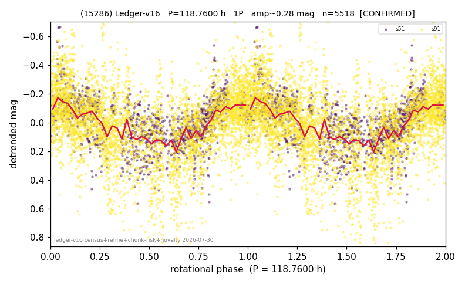

# (15286)

**Adopted:** 118.76 h, 1P, CANDIDATE

<!-- AUTO:START (regenerated from pipeline outputs; do not hand-edit this block) -->
## Evidence (auto)

Detected in 2 sector(s):

| sector | N | baseline (h) | P_phot (h) | power | FAP | cycles | flags |
|--|--|--|--|--|--|--|--|
| s51 | 1203 | 460.5 | 121.4433 | 0.3749 | 2.7e-118 | 3.8 | star-cleaned:19,2P-untestable,2P-ambiguo |
| s91 | 4375 | 647.9 | 116.0759 | 0.1912 | 7.9e-197 | 2.8 | star-cleaned:164 |

- Pipeline refine said: **1P** (folded amp_fourier 0.352); flags: amp-from-clean-sectors(ignored s91);few-cycle:2.7;gap-alias-risk:186h;sick-dips-excised:s5
- DIA (de-comb): reject_v2(ret=0.513[0.26-0.61],s51@118.760h)
- Coverage: **2 sector(s)**, best sector covers **5.46 cycles** of the adopted period. Measured periodogram peak width 19% of the period, i.e. about **+/- 9.613 h** (1 sigma); the decimal places in the adopted value are not a precision claim.
- Factor of two: no doubling was applied.
- Gates: FAP<1e-3 and power>=0.10 per detecting sector; single strong sector (candidate ceiling).
- Adopted shape: **1P** (folded-amplitude rule; pipeline agrees).

### Why this row reads the way it does

- 2 sector(s) detecting
- cross-sector fold correlation 0.66
- single-peaked at folded amp 0.352 mag
- pipeline flag: few-cycle
- DOWNGRADED CONFIRMED->CANDIDATE 2026-08-16 (adversarial review): on s51 a degree-4 polynomial beats the rotation model (R2 0.506 vs 0.194) and the half-split fails (44% off); amplitude 0.40-0.44 contradicts the declared 1P

<!-- AUTO:END -->
