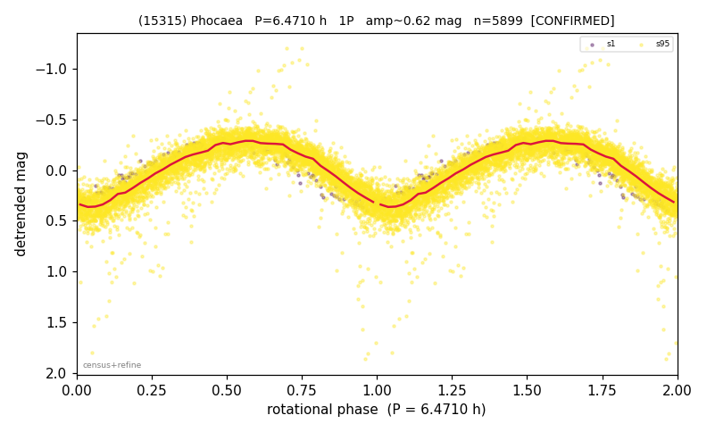

# (15315)

**Adopted:** 12.942 h, 2P, CONFIRMED

<!-- AUTO:START (regenerated from pipeline outputs; do not hand-edit this block) -->
## Evidence (auto)

Detected in 2 sector(s):

| sector | N | baseline (h) | P_phot (h) | power | FAP | cycles | flags |
|--|--|--|--|--|--|--|--|
| s1 | 122 | 101.0 | 6.4718 | 0.9501 | 3.4e-74 | 15.6 | 2P-ambiguous |
| s95 | 5777 | 436.0 | 6.4705 | 0.824 | 0.0e+00 | 67.4 | star-cleaned:3,2P-ambiguous |

- Pipeline refine said: **2P** (folded amp_fourier 0.642); flags: sick-dips-excised:s95(38)
- DIA (de-comb): survived(dPW=+1%,R2=0.03,s1@6.471h,3sec)
- Coverage: **1 sector(s)**, best sector covers **33.69 cycles** of the adopted period. Measured periodogram peak width 1% of the period, i.e. about **+/- 0.04 h** (1 sigma); the decimal places in the adopted value are not a precision claim.
- Factor of two: **adopted on the amplitude convention**: standard practice for an elongated body, but a convention rather than a measurement.
- Gates: FAP<1e-3 and power>=0.10 per detecting sector; >=2 sectors agree (harmonic-aware).
- Adopted shape: **2P** (folded-amplitude rule; pipeline agrees).

### Why this row reads the way it does

- DOUBLED 1P->2P 6.471->12.942h (high-amp 1P audit 2026-07-18: folded amp 0.616 = elongated/double-peaked; house rule amp>0.40->2P).

<!-- AUTO:END -->
