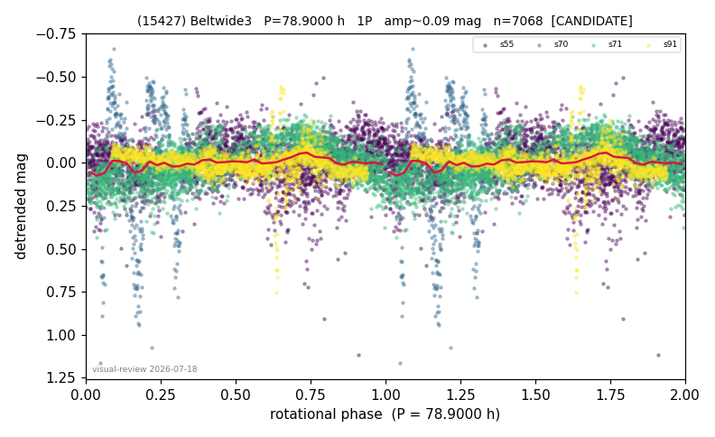

# (15427)

**Adopted:** 78.9 h, 2P, CONFIRMED

<!-- AUTO:START (regenerated from pipeline outputs; do not hand-edit this block) -->
## Evidence (auto)

Detected in 4 sector(s):

| sector | N | baseline (h) | P_phot (h) | power | FAP | cycles | flags |
|--|--|--|--|--|--|--|--|
| s55 | 2377 | 558.8 | 39.4518 | 0.1257 | 4.9e-65 | 14.2 | star-cleaned:15,2P-ambiguous |
| s70 | 429 | 23.9 | 10.9466 | 0.4347 | 2.5e-49 | 2.2 | grid-edge,phase-curve-risk |
| s71 | 2551 | 175.2 | 75.7105 | 0.4789 | 0.0e+00 | 2.3 | phase-curve-risk,2P-untestable,2P-ambigu |
| s91 | 1711 | 111.6 | 35.9548 | 0.1208 | 8.1e-44 | 3.1 | star-cleaned:9,2P-untestable,2P-ambiguou |

- Pipeline refine said: **1P** (folded amp_fourier 0.235); flags: gap-alias-risk:53h;sick-dips-excised:s55(1);harmonic-only-agreement:s55(pw=0.08),s71(pw=0.
- DIA (de-comb): flag_v2(ret=0.707[0.52-0.89],s71@77.308h)
- Coverage: **4 sector(s)**, best sector covers **14.17 cycles** of the adopted period. Measured periodogram peak width 7% of the period, i.e. about **+/- 1.179 h** (1 sigma); the decimal places in the adopted value are not a precision claim.
- Factor of two: no doubling was applied.
- Gates: FAP<1e-3 and power>=0.10 per detecting sector; >=2 sectors agree (harmonic-aware).
- **Adopted shape 2P OVERRIDES the pipeline's 1P** (doubling audit 2026-07-25: folded amplitude >= 0.25 mag, so a single-peaked curve is physically implausible; Harris convention -> 2P. The census 3-test doubling logic was measured at only 30% recall against 289 LCDB U>=2 ground-truth periods).

### Why this row reads the way it does

- CORRECTED 78.9->39.45 1P: amp 0.17<<0.40, the 78.9 re-derivation was inter-sector alias smear; ZTF blind-recovers 39.2/78.6 harmonic pair FAP 4.8e-21
- DOUBLING CORRECTED 2026-08-30: adopted period doubled from 39.45 h. The previous value came from the folded-amplitude rule, which was found biased low (9 of 9 disagreements with MPB 2024-2026 in the same direction). Odd-harmonic test at the long period gives z1=10.45 with margin 5.59 over non-harmonic multiples 1.7x/2.3x (reference group: 0 of 38 above margin 2).

<!-- AUTO:END -->

**v2 note (2026-08-24):** s71 sits in the v2 set-aside zone (ret 0.707 [0.52-0.89]). Status confirmed: the period rests on s55 (14.2 cycles) + harmonic-aware s71 agreement + blind ZTF recovery of the 39.2/78.6 h pair (FAP 4.8e-21). Independent review: KEEP.
