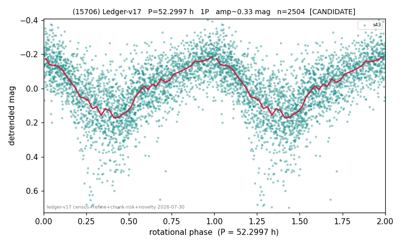

# (15706)

**Adopted:** 52.2997 h, 1P, CANDIDATE

<!-- AUTO:START (regenerated from pipeline outputs; do not hand-edit this block) -->
## Evidence (auto)

Detected in 1 sector(s):

| sector | N | baseline (h) | P_phot (h) | power | FAP | cycles | flags |
|--|--|--|--|--|--|--|--|
| s43 | 2528 | 593.2 | 52.2997 | 0.4556 | 0.0e+00 | 5.7 | star-cleaned:2 |

- Pipeline refine said: **1P** (folded amp_fourier 0.378); flags: gap-alias-risk:102h;sick-dips-excised:s43(6);near-threshold:0.38
- DIA (de-comb): survived_v2(ret=0.963[0.93-0.99],s43@52.300h)
- Coverage: **1 sector(s)**, best sector covers **11.34 cycles** of the adopted period. Measured periodogram peak width 7% of the period, i.e. about **+/- 1.598 h** (1 sigma); the decimal places in the adopted value are not a precision claim.
- Factor of two: no doubling was applied.
- Gates: FAP<1e-3 and power>=0.10 per detecting sector; single strong sector (candidate ceiling).
- Adopted shape: **1P** (folded-amplitude rule; pipeline agrees).

### Why this row reads the way it does

- 1 sector(s) detecting
- single-peaked at folded amp 0.378 mag

<!-- AUTO:END -->
