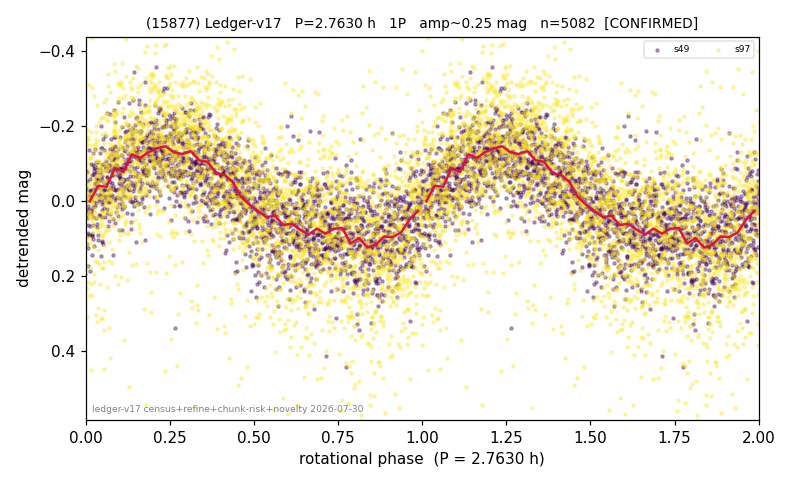

# (15877)

**Adopted:** 2.763 h, 1P, CONFIRMED

<!-- AUTO:START (regenerated from pipeline outputs; do not hand-edit this block) -->
## Evidence (auto)

Detected in 2 sector(s):

| sector | N | baseline (h) | P_phot (h) | power | FAP | cycles | flags |
|--|--|--|--|--|--|--|--|
| s49 | 2249 | 584.7 | 2.7627 | 0.487 | 0.0e+00 | 211.6 | star-cleaned:30,2P-ambiguous |
| s97 | 2870 | 221.5 | 2.7637 | 0.3739 | 5.0e-287 | 80.1 | star-cleaned:39,2P-ambiguous |

- Pipeline refine said: **1P** (folded amp_fourier 0.302); flags: sick-dips-excised:s49(4),s97(13)
- DIA (de-comb): **NOT RUN for this lot.** No de-comb verdict exists for this object, so momentum-dump contamination has not been excluded by that test here.
- Gates: FAP<1e-3 and power>=0.10 per detecting sector; >=2 sectors agree (harmonic-aware).
- Adopted shape: **1P** (folded-amplitude rule; pipeline agrees).

### Why this row reads the way it does

- 2 sector(s) detecting
- cross-sector fold correlation 0.96
- single-peaked at folded amp 0.302 mag

<!-- AUTO:END -->
