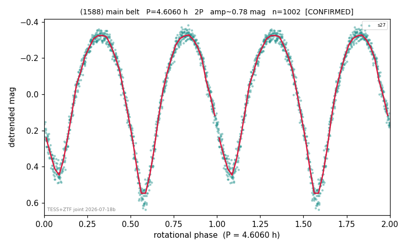

# (1588)

**Adopted:** 4.606 h, 2P, CONFIRMED

<!-- AUTO:START (regenerated from pipeline outputs; do not hand-edit this block) -->
## Evidence (auto)

Detected in 1 sector(s):

| sector | N | baseline (h) | P_phot (h) | power | FAP | cycles | flags |
|--|--|--|--|--|--|--|--|
| s27 | 1002 | 196.5 | 2.3038 | 0.9439 | 0.0e+00 | 85.3 | 2P-ambiguous |

- Refined shape: **2P** (folded amp_fourier 0.812); flags: clean
- DIA (de-comb): not triggered (clean, fast, non-comb)
- Gates: FAP<1e-3 and power>=0.10 per detecting sector; >=2 sectors agree (harmonic-aware); folded-amplitude rule -> 2P.

<!-- AUTO:END -->
