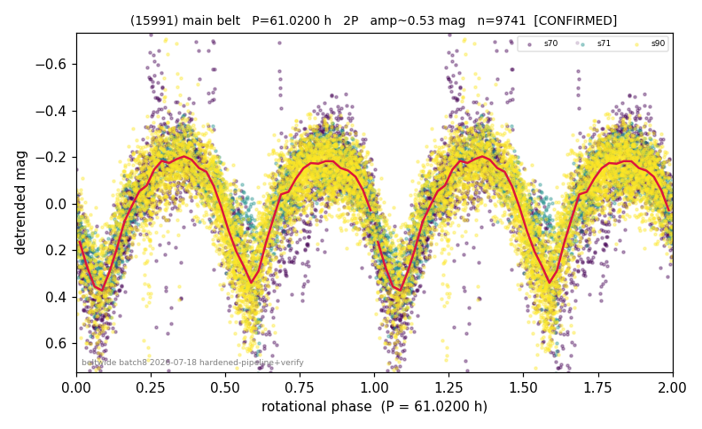

# (15991)

**Adopted:** 61.02 h, 2P, CONFIRMED

<!-- AUTO:START (regenerated from pipeline outputs; do not hand-edit this block) -->
## Evidence (auto)

Detected in 3 sector(s):

| sector | N | baseline (h) | P_phot (h) | power | FAP | cycles | flags |
|--|--|--|--|--|--|--|--|
| s70 | 2959 | 404.9 | 30.4068 | 0.5805 | 0.0e+00 | 6.7 | star-cleaned:118 |
| s71 | 1797 | 135.6 | 30.7458 | 0.7244 | 0.0e+00 | 4.4 | 2P-ambiguous |
| s90 | 5001 | 363.1 | 30.5097 | 0.592 | 0.0e+00 | 11.9 | star-cleaned:84,2P-ambiguous |

- Refined shape: **2P** (folded amp_fourier 0.596); flags: near-comb(amp-cleared):n=11;sick-dips-excised:s70(8),s90(3)
- DIA (de-comb): survived(dPW=-0%,R2=0.06,s71@30.510h,7sec)
- Gates: FAP<1e-3 and power>=0.10 per detecting sector; >=2 sectors agree (harmonic-aware); folded-amplitude rule -> 2P.

<!-- AUTO:END -->

## Reasoning
3 sectors agree fundamental ~30.5 h, folded amp 0.60 > 0.40 -> 2P. Slow-ish.
## Verdict
CONFIRMED 2P / 61.02 h.
## Caveats
s70 heavily contaminated (raw range 5 mag); split-half + amplitude checks hold up but eyeball the s70 fold before publishing.
