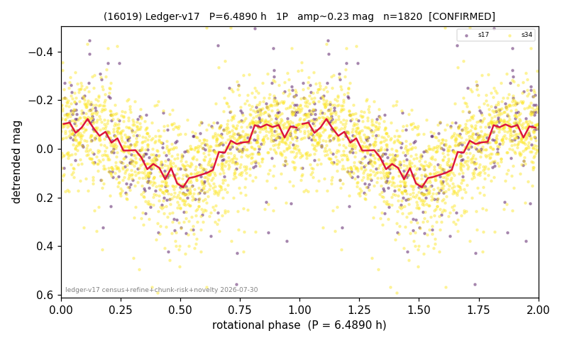

# (16019)

**Adopted:** 6.489 h, 1P, CONFIRMED

<!-- AUTO:START (regenerated from pipeline outputs; do not hand-edit this block) -->
## Evidence (auto)

Detected in 2 sector(s):

| sector | N | baseline (h) | P_phot (h) | power | FAP | cycles | flags |
|--|--|--|--|--|--|--|--|
| s17 | 286 | 420.0 | 6.4797 | 0.2492 | 1.1e-14 | 64.8 | star-cleaned:1,2P-ambiguous |
| s34 | 1537 | 343.0 | 6.4981 | 0.23 | 4.8e-83 | 52.8 | star-cleaned:37,2P-ambiguous |

- Pipeline refine said: **1P** (folded amp_fourier 0.318); flags: sick-dips-excised:s34(1)
- DIA (de-comb): **NOT RUN for this lot.** No de-comb verdict exists for this object, so momentum-dump contamination has not been excluded by that test here.
- Gates: FAP<1e-3 and power>=0.10 per detecting sector; >=2 sectors agree (harmonic-aware).
- Adopted shape: **1P** (folded-amplitude rule; pipeline agrees).

### Why this row reads the way it does

- 2 sector(s) detecting
- cross-sector fold correlation 0.86
- single-peaked at folded amp 0.318 mag

<!-- AUTO:END -->
