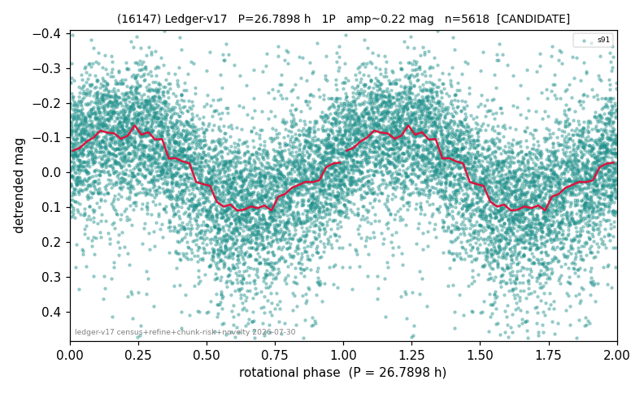

# (16147)

**Adopted:** 26.7898 h, 1P, CANDIDATE

<!-- AUTO:START (regenerated from pipeline outputs; do not hand-edit this block) -->
## Evidence (auto)

Detected in 1 sector(s):

| sector | N | baseline (h) | P_phot (h) | power | FAP | cycles | flags |
|--|--|--|--|--|--|--|--|
| s91 | 5678 | 600.3 | 26.7898 | 0.3135 | 0.0e+00 | 22.4 | star-cleaned:72,2P-ambiguous |

- Pipeline refine said: **1P** (folded amp_fourier 0.247); flags: dump-alias-suspect:n=12;sick-dips-excised:s91(15)
- DIA (de-comb): survived(dPW=-5%,R2=0.03,s91@26.790h,2sec)
- Coverage: **1 sector(s)**, best sector covers **22.41 cycles** of the adopted period. Measured periodogram peak width 4% of the period, i.e. about **+/- 0.43 h** (1 sigma); the decimal places in the adopted value are not a precision claim.
- Factor of two: no doubling was applied.
- **Chunk quarantine**: this period rests on chunk-extracted photometry whose stitching filters variation slower than one chunk. It is excluded from the catalog's headline counts.
- Gates: FAP<1e-3 and power>=0.10 per detecting sector; single strong sector (candidate ceiling).
- Adopted shape: **1P** (folded-amplitude rule; pipeline agrees).

### Why this row reads the way it does

- 1 sector(s) detecting
- single-peaked at folded amp 0.247 mag
- CHUNK QUARANTINE (BROKEN_CHUNK;AMP_DOMINATED): a chunk returned too few points for its median to mean anything, or the applied offsets are large and not a smooth ramp; the stitching steps applied between chunks are LARGER than the object's own folded amplitude, so any fold shape may be an artefact. Needs a direct re-extraction before this period can be claimed
- pipeline flag: dump-alias-suspect

<!-- AUTO:END -->
