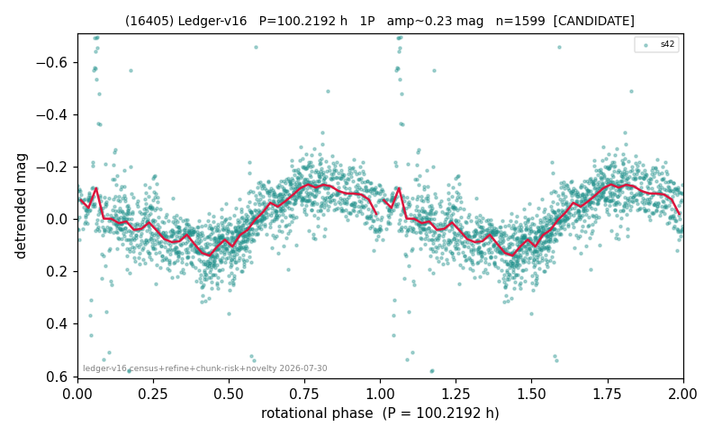

# (16405)

**Adopted:** 100.2192 h, 1P, CANDIDATE

<!-- AUTO:START (regenerated from pipeline outputs; do not hand-edit this block) -->
## Evidence (auto)

Detected in 1 sector(s):

| sector | N | baseline (h) | P_phot (h) | power | FAP | cycles | flags |
|--|--|--|--|--|--|--|--|
| s42 | 1607 | 552.5 | 100.2192 | 0.5098 | 6.1e-244 | 5.5 | star-cleaned:5,2P-ambiguous |

- Pipeline refine said: **1P** (folded amp_fourier 0.255); flags: few-cycle:2.8;gap-alias-risk:118h;sick-dips-excised:s42(6)
- DIA (de-comb): reject_v2(ret=0.552[0.50-0.82],s42@100.219h)
- Coverage: **1 sector(s)**, best sector covers **5.51 cycles** of the adopted period. Measured periodogram peak width 17% of the period, i.e. about **+/- 7.062 h** (1 sigma); the decimal places in the adopted value are not a precision claim.
- Factor of two: no doubling was applied.
- Gates: FAP<1e-3 and power>=0.10 per detecting sector; single strong sector (candidate ceiling).
- Adopted shape: **1P** (folded-amplitude rule; pipeline agrees).

### Why this row reads the way it does

- 1 sector(s) detecting
- single-peaked at folded amp 0.255 mag
- pipeline flag: few-cycle

<!-- AUTO:END -->
