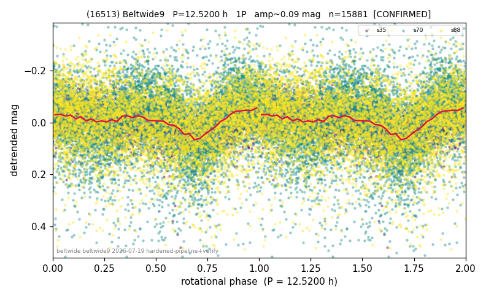

# (16513)

**Adopted:** 12.52 h, 1P, CONFIRMED

<!-- AUTO:START (regenerated from pipeline outputs; do not hand-edit this block) -->
## Evidence (auto)

Detected in 3 sector(s):

| sector | N | baseline (h) | P_phot (h) | power | FAP | cycles | flags |
|--|--|--|--|--|--|--|--|
| s35 | 2257 | 582.0 | 12.5179 | 0.1545 | 6.8e-78 | 46.5 | star-cleaned:6 |
| s70 | 7708 | 512.1 | 6.271 | 0.1236 | 1.1e-215 | 81.7 | star-cleaned:149,2P-ambiguous |
| s88 | 6021 | 437.8 | 12.5595 | 0.0431 | 4.5e-53 | 34.9 | star-cleaned:2 |

- Pipeline refine said: **1P** (folded amp_fourier 0.076); flags: sick-dips-excised:s70(61);harmonic-only-agreement:s70(pw=0.01);period-spread:66%
- DIA (de-comb): survived(dPW=-5%,R2=0.13,s35@12.530h,4sec)
- Gates: FAP<1e-3 and power>=0.10 per detecting sector; >=2 sectors agree (harmonic-aware).
- Adopted shape: **1P** (folded-amplitude rule; pipeline agrees).

### Why this row reads the way it does

- folded_amp=0.086. s35 at P + s70 at P/2 agree 0.1% (harmonic-aware, FAP 7e-78/1e-215), s88 corroborates; amp<<0.40 -> 1P. REVIEW-FLAG: 1.0% off comb n=26 (cleared: independent-sector harmonic agreement) + s70 cleaning worth an eyeball.

<!-- AUTO:END -->
