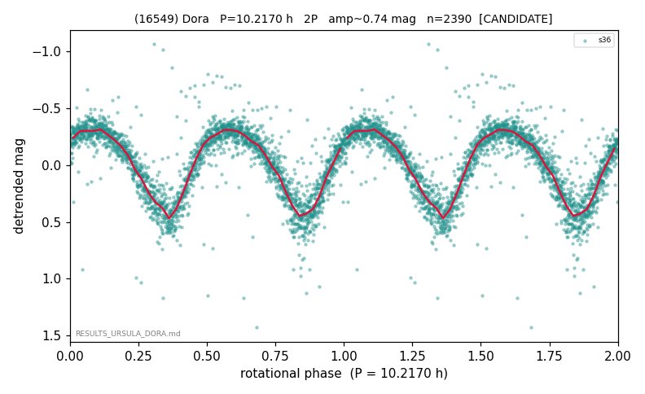

# (16549)

**Adopted:** 10.217 h, 2P, CANDIDATE

<!-- AUTO:START (regenerated from pipeline outputs; do not hand-edit this block) -->
## Evidence (auto)

Detected in 1 sector(s):

| sector | N | baseline (h) | P_phot (h) | power | FAP | cycles | flags |
|--|--|--|--|--|--|--|--|
| s36 | 2390 | 499.8 | 5.1083 | 0.8124 | 0.0e+00 | 97.8 | star-cleaned:3,2P-ambiguous |

- Pipeline refine said: **2P** (folded amp_fourier 0.718); flags: sick-dips-excised:s36(10)
- DIA (de-comb): survived(dPW=-0%,R2=0.01,s36@5.108h,2sec)
- Coverage: **1 sector(s)**, best sector covers **48.92 cycles** of the adopted period. Measured periodogram peak width 1% of the period, i.e. about **+/- 0.02 h** (1 sigma); the decimal places in the adopted value are not a precision claim.
- Factor of two: **not stated**, which is a defect in this entry.
- Gates: FAP<1e-3 and power>=0.10 per detecting sector; single strong sector (candidate ceiling).
- Adopted shape: **2P** (folded-amplitude rule; pipeline agrees).

### Why this row reads the way it does

- base 5.108h rock-solid; 2P by amplitude (0.74)

<!-- AUTO:END -->
