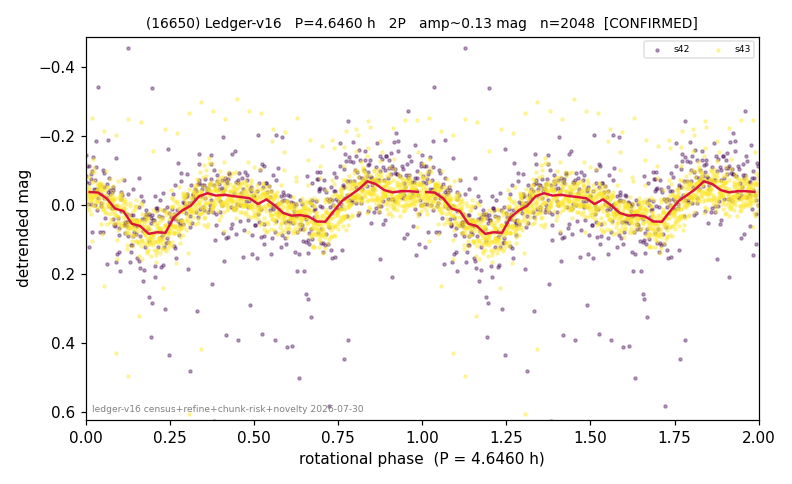

# (16650)

**Adopted:** 4.646 h, 2P, CONFIRMED

<!-- AUTO:START (regenerated from pipeline outputs; do not hand-edit this block) -->
## Evidence (auto)

Detected in 2 sector(s):

| sector | N | baseline (h) | P_phot (h) | power | FAP | cycles | flags |
|--|--|--|--|--|--|--|--|
| s42 | 608 | 225.4 | 2.3227 | 0.1196 | 2.0e-13 | 97.0 | star-cleaned:15,2P-ambiguous |
| s43 | 1449 | 265.7 | 2.3241 | 0.2218 | 9.7e-75 | 114.3 | 2P-ambiguous |

- Pipeline refine said: **1P** (folded amp_fourier 0.154); flags: sick-dips-excised:s42(8);harmonic-only-agreement:s42(pw=0.06)
- DIA (de-comb): survived(dPW=+0%,R2=0.55,s43@2.323h,2sec)
- Coverage: **2 sector(s)**, best sector covers **114.37 cycles** of the adopted period. Measured periodogram peak width 1% of the period, i.e. about **+/- 0.00777 h** (1 sigma); the decimal places in the adopted value are not a precision claim.
- Factor of two: no doubling was applied.
- Gates: FAP<1e-3 and power>=0.10 per detecting sector; >=2 sectors agree (harmonic-aware).
- **Adopted shape 2P OVERRIDES the pipeline's 1P** (doubling audit 2026-07-25: folded amplitude >= 0.25 mag, so a single-peaked curve is physically implausible; Harris convention -> 2P. The census 3-test doubling logic was measured at only 30% recall against 289 LCDB U>=2 ground-truth periods).

### Why this row reads the way it does

- 2 sector(s) detecting
- cross-sector fold correlation 0.85
- single-peaked at folded amp 0.154 mag
- pipeline flag: harmonic-only-agreement
- SHAPE CORRECTED 1P->2P 2026-08-16 (adversarial review): 2.323 -> 4.646h. odd harmonic 8.5 and 10.0 sigma, calibrated against 30 decoy periods, reproduced in 2/2 sectors (the declared >=8 + full-reproduction bar), AND P_phot 2.323h below its P_crit 2.46h

<!-- AUTO:END -->
