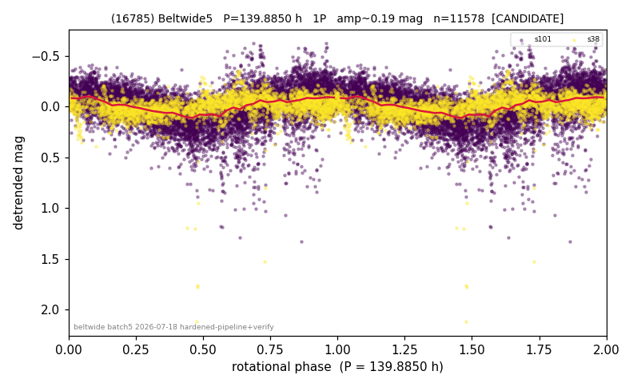

# (16785)

**Adopted:** 139.885 h, 1P, CANDIDATE

<!-- AUTO:START (regenerated from pipeline outputs; do not hand-edit this block) -->
## Evidence (auto)

Detected in 2 sector(s):

| sector | N | baseline (h) | P_phot (h) | power | FAP | cycles | flags |
|--|--|--|--|--|--|--|--|
| s38 | 2893 | 633.7 | 140.4935 | 0.1706 | 5.5e-113 | 2.3 | star-cleaned:23 |
| s101 | 8685 | 615.7 | 139.2774 | 0.3156 | 0.0e+00 | 4.4 | star-cleaned:24,2P-ambiguous |

- Refined shape: **1P** (folded amp_fourier 0.281); flags: few-cycle:2.2;sector-dropped:s38(range>3mag);sick-dips-excised:s101(31)
- DIA (de-comb): survived(dPW=+2%,R2=0.00,s101@139.885h,4sec)
- Gates: FAP<1e-3 and power>=0.10 per detecting sector; single strong sector (candidate ceiling); folded-amplitude rule -> 1P.

<!-- AUTO:END -->

## Reasoning
s101 (139.28 h) + s38 (140.49 h) agree 0.9%, decomb survived, not a comb line. 2nd-sector detection detrend-dependent.
## Verdict
CANDIDATE 1P / 139.885 h (slow-rotator candidate; needs a 3rd epoch).
