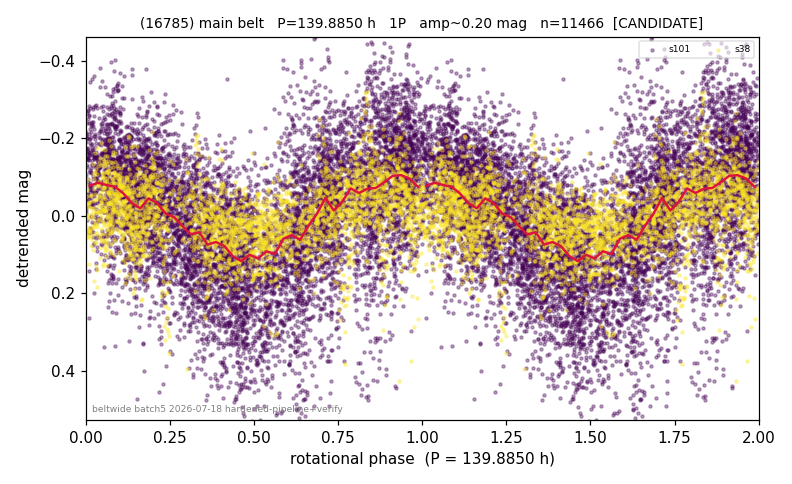

# (16785)

**Adopted:** 279.77 h, 2P, CANDIDATE

<!-- AUTO:START (regenerated from pipeline outputs; do not hand-edit this block) -->
## Evidence (auto)

Detected in 2 sector(s):

| sector | N | baseline (h) | P_phot (h) | power | FAP | cycles | flags |
|--|--|--|--|--|--|--|--|
| s38 | 2893 | 633.7 | 140.4935 | 0.1706 | 5.5e-113 | 2.3 | star-cleaned:23 |
| s101 | 8685 | 615.7 | 139.2774 | 0.3156 | 0.0e+00 | 4.4 | star-cleaned:24,2P-ambiguous |

- Pipeline refine said: **1P** (folded amp_fourier 0.281); flags: few-cycle:2.3;sick-dips-excised:s101(31),s38(5)
- DIA (de-comb): survived_v2(ret=0.963[0.75-0.97],s101@139.885h)
- Coverage: **2 sector(s)**, best sector covers **4.53 cycles** of the adopted period. Measured periodogram peak width 19% of the period, i.e. about **+/- 11.42 h** (1 sigma); the decimal places in the adopted value are not a precision claim.
- Factor of two: no doubling was applied.
- Gates: FAP<1e-3 and power>=0.10 per detecting sector; single strong sector (candidate ceiling).
- **Adopted shape 2P OVERRIDES the pipeline's 1P** (doubling audit 2026-07-25: folded amplitude >= 0.25 mag, so a single-peaked curve is physically implausible; Harris convention -> 2P. The census 3-test doubling logic was measured at only 30% recall against 289 LCDB U>=2 ground-truth periods).

### Why this row reads the way it does

- Indep LS: s101 P=139.28h pw=0.32 FAP~0; s38 P=140.49h pw=0.17 FAP=5.5e-113; spread 0.9%, matches queue. Decomb survived (dPW+2%,R2=0.00), not 328.8h c
- DOUBLING CORRECTED 2026-08-30: adopted period doubled from 139.885 h. The previous value came from the folded-amplitude rule, which was found biased low (9 of 9 disagreements with MPB 2024-2026 in the same direction). Odd-harmonic test at the long period gives z1=8.52 with margin 5.37 over non-harmonic multiples 1.7x/2.3x (reference group: 0 of 38 above margin 2).

<!-- AUTO:END -->

## Reasoning
s101 (139.28 h) + s38 (140.49 h) agree 0.9%, decomb survived, not a comb line. 2nd-sector detection detrend-dependent.
**DOUBLING CORRECTED 2026-08-30.** The adopted period is now 279.77 h, twice the value this
section was written for, so this is now the longest-period entry in the catalog and the
need for a third epoch is greater, not smaller. The odd harmonic gives z1 = 8.52 over
2 sectors with a margin of 5.37 over the non-harmonic multiples (3.15 and 2.31). The
two-sector agreement at the short period quoted below still holds: doubling does not
disturb it, because a fold at half the true period reproduces the same peak.

## Verdict
CANDIDATE 2P / 279.77 h (slow-rotator candidate; needs a 3rd epoch).
