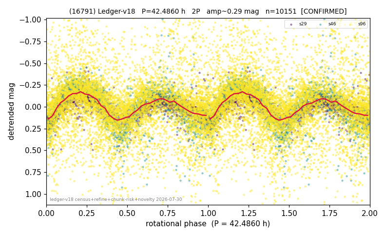

# (16791)

**Adopted:** 42.486 h, 2P, CONFIRMED

<!-- AUTO:START (regenerated from pipeline outputs; do not hand-edit this block) -->
## Evidence (auto)

Detected in 3 sector(s):

| sector | N | baseline (h) | P_phot (h) | power | FAP | cycles | flags |
|--|--|--|--|--|--|--|--|
| s29 | 1639 | 375.3 | 21.2645 | 0.4414 | 1.3e-202 | 17.7 | star-cleaned:11,2P-ambiguous |
| s46 | 1634 | 348.4 | 21.1407 | 0.5406 | 3.6e-271 | 8.2 | star-cleaned:9 |
| s96 | 7101 | 592.1 | 21.243 | 0.1481 | 2.6e-242 | 27.9 | star-cleaned:247,2P-ambiguous |

- Pipeline refine said: **2P** (folded amp_fourier 0.452); flags: near-comb(amp-cleared):n=8,15;sick-dips-excised:s29(9),s46(4),s96(159);harmonic-only-agree
- DIA (de-comb): survived(dPW=+4%,R2=0.12,s46@21.243h,6sec)
- Gates: FAP<1e-3 and power>=0.10 per detecting sector; >=2 sectors agree (harmonic-aware).
- Adopted shape: **2P** (folded-amplitude rule; pipeline agrees).

### Why this row reads the way it does

- 3 sector(s) detecting
- cross-sector fold correlation 0.93
- doubling BY CONVENTION: amplitude rule on folded amp 0.452 mag, not individually audited
- pipeline flag: harmonic-only-agreement

<!-- AUTO:END -->
