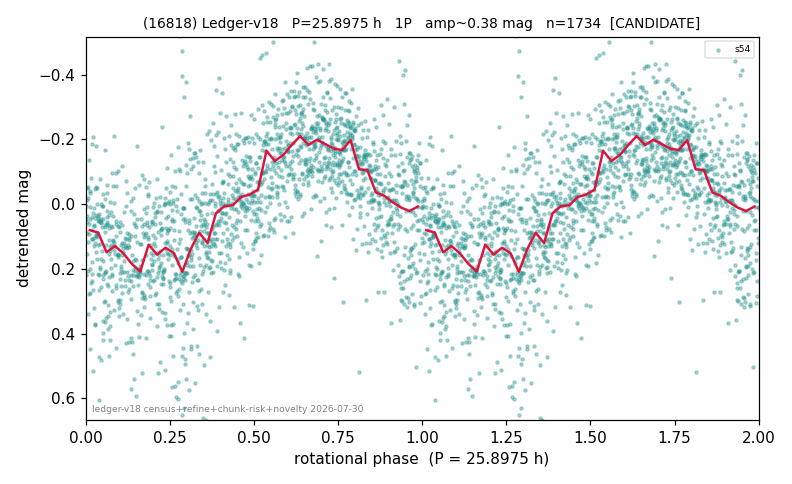

# (16818)

**Adopted:** 25.8975 h, 1P, CANDIDATE

<!-- AUTO:START (regenerated from pipeline outputs; do not hand-edit this block) -->
## Evidence (auto)

Detected in 1 sector(s):

| sector | N | baseline (h) | P_phot (h) | power | FAP | cycles | flags |
|--|--|--|--|--|--|--|--|
| s54 | 1758 | 629.2 | 25.8975 | 0.4518 | 1.1e-224 | 24.3 | star-cleaned:3,2P-ambiguous |

- Pipeline refine said: **1P** (folded amp_fourier 0.393); flags: near-comb(amp-cleared):n=13;sick-dips-excised:s54(3);near-threshold:0.39
- DIA (de-comb): survived(dPW=+6%,R2=0.17,s54@25.898h,1sec)
- Coverage: **1 sector(s)**, best sector covers **24.29 cycles** of the adopted period. Measured periodogram peak width 3% of the period, i.e. about **+/- 0.38 h** (1 sigma); the decimal places in the adopted value are not a precision claim.
- Factor of two: no doubling was applied.
- Gates: FAP<1e-3 and power>=0.10 per detecting sector; single strong sector (candidate ceiling).
- Adopted shape: **1P** (folded-amplitude rule; pipeline agrees).

### Why this row reads the way it does

- 1 sector(s) detecting
- single-peaked at folded amp 0.393 mag

<!-- AUTO:END -->
