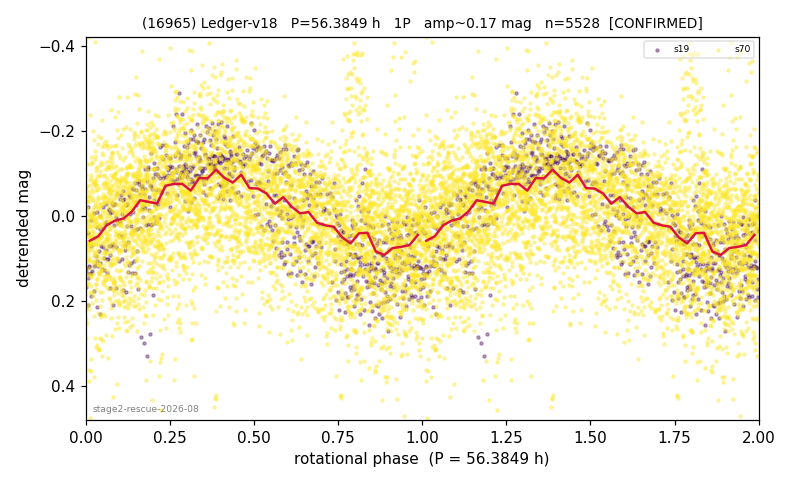

# (16965)

**Adopted:** 56.3849 h, 1P, CONFIRMED

<!-- AUTO:START (regenerated from pipeline outputs; do not hand-edit this block) -->
## Evidence (auto)

Detected in 2 sector(s):

| sector | N | baseline (h) | P_phot (h) | power | FAP | cycles | flags |
|--|--|--|--|--|--|--|--|
| s19 | 786 | 597.5 | 56.3857 | 0.6433 | 2.8e-171 | 10.6 | 2P-ambiguous |
| s70 | 4795 | 347.2 | 56.8602 | 0.1335 | 2.0e-144 | 6.1 | star-cleaned:163,2P-ambiguous |

- Pipeline refine said: **1P** (folded amp_fourier 0.196); flags: few-cycle:3.1;sick-dips-excised:s70(14)
- DIA (de-comb): survived_v2(ret=1.016[0.97-1.02],s70@56.860h)
- Coverage: **2 sector(s)**, best sector covers **10.6 cycles** of the adopted period. Measured periodogram peak width 8% of the period, i.e. about **+/- 2.012 h** (1 sigma); the decimal places in the adopted value are not a precision claim.
- Factor of two: no doubling was applied.
- Gates: FAP<1e-3 and power>=0.10 per detecting sector; >=2 sectors agree (harmonic-aware).
- Adopted shape: **1P** (folded-amplitude rule; pipeline agrees).

### Why this row reads the way it does

- stage-2 crowding-rescue harvest (|b| 5-15 deg, METHODOLOGY 5b-ter), verified 2026-08-10 by refutation-first waves: blind LS+PDM re-derivation, harmonic-aware comb test, field control where near-comb (LS power at the same frequency on >=15 unknown objects of the same sector), shape rules per 3b, all vetoes checked
- shape corrected to 1P in verification: doubling measured only in s70 (z=96.5), s19 fails the bar (z=3.6); amp 0.25 below the rule

<!-- AUTO:END -->
