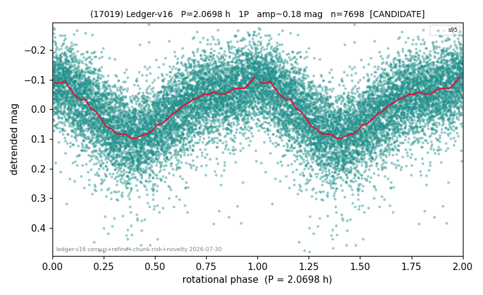

# (17019)

**Adopted:** 4.1396 h, 2P, CONFIRMED

<!-- AUTO:START (regenerated from pipeline outputs; do not hand-edit this block) -->
## Evidence (auto)

Detected in 2 sector(s):

| sector | N | baseline (h) | P_phot (h) | power | FAP | cycles | flags |
|--|--|--|--|--|--|--|--|
| s59 | 6108 | 416.2 | 2.0699 | 0.06 | 1.9e-77 | 201.1 | star-cleaned:23 |
| s95 | 7704 | 592.5 | 2.0698 | 0.3347 | 0.0e+00 | 286.2 | star-cleaned:103,2P-ambiguous |

- Pipeline refine said: **1P** (folded amp_fourier 0.193); flags: sick-dips-excised:s95(6)
- DIA (de-comb): survived_v2(ret=1.000[1.00-1.00],s95@2.070h)
- Coverage: **2 sector(s)**, best sector covers **143.13 cycles** of the adopted period. Measured periodogram peak width 0% of the period, i.e. about **+/- 0.003231 h** (1 sigma); the decimal places in the adopted value are not a precision claim.
- Factor of two: **measured on the data** (odd-harmonic power or unequal minima, significant and reproduced), METHODOLOGY 3b.
- Gates: FAP<1e-3 and power>=0.10 per detecting sector; >=2 sectors agree (harmonic-aware).
- **Adopted shape 2P OVERRIDES the pipeline's 1P** (doubling audit 2026-07-25: folded amplitude >= 0.25 mag, so a single-peaked curve is physically implausible; Harris convention -> 2P. The census 3-test doubling logic was measured at only 30% recall against 289 LCDB U>=2 ground-truth periods).

### Why this row reads the way it does

- 1 sector(s) detecting
- single-peaked at folded amp 0.193 mag
- CORRECTED 2.0698->4.1396 h (2026-08-01 sub-barrier sweep): all 49 catalog periods below 2.2 h sat on 5-16 km bodies, impossible as true rotations; doubling MEASURED in the 2026-08-01 fast-rotator re-audit: odd-harmonic 5.98 sigma (1/1 sectors), minima z=-1.29
- PROMOTED CANDIDATE->CONFIRMED 2026-08-15 (TESS+ZTF joint, the user-blessed pathway): independent ZTF blind Lomb-Scargle over 6.7 yr / 192 g+r points recovers 2.0697 h = TESS-P/2 2.0698h to 0.00%, power 0.495, trials-corrected FAP 3.3e-23, beating every alias/comb candidate (alias 1.9055h at 0.421); a ZTF detection cannot be a TESS comb tooth or TESS red noise, so this is a genuine second realization and the single-sector ceiling no longer applies

<!-- AUTO:END -->
