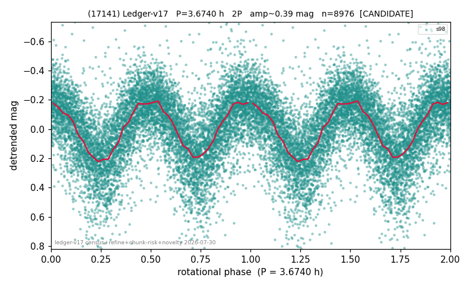

# (17141)

**Adopted:** 3.674 h, 2P, CANDIDATE

<!-- AUTO:START (regenerated from pipeline outputs; do not hand-edit this block) -->
## Evidence (auto)

Detected in 1 sector(s):

| sector | N | baseline (h) | P_phot (h) | power | FAP | cycles | flags |
|--|--|--|--|--|--|--|--|
| s98 | 8998 | 677.0 | 1.837 | 0.3719 | 0.0e+00 | 368.5 | star-cleaned:85,2P-ambiguous |

- Pipeline refine said: **2P** (folded amp_fourier 0.432); flags: sick-dips-excised:s98(8);near-threshold:0.43
- DIA (de-comb): not triggered (clean, fast, non-comb)
- Gates: FAP<1e-3 and power>=0.10 per detecting sector; single strong sector (candidate ceiling).
- Adopted shape: **2P** (folded-amplitude rule; pipeline agrees).

### Why this row reads the way it does

- 1 sector(s) detecting
- doubling BY CONVENTION: amplitude rule on folded amp 0.432 mag, not individually audited

<!-- AUTO:END -->
