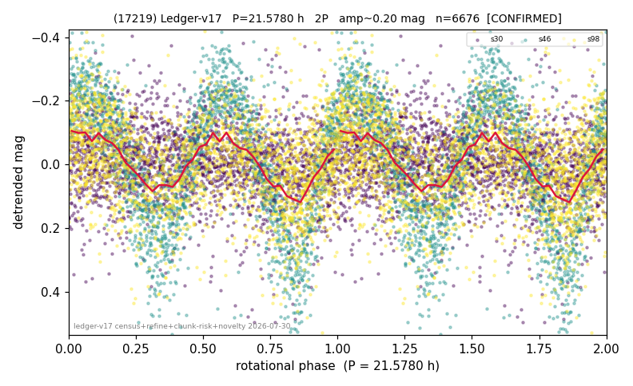

# (17219)

**Adopted:** 21.578 h, 2P, CONFIRMED

<!-- AUTO:START (regenerated from pipeline outputs; do not hand-edit this block) -->
## Evidence (auto)

Detected in 3 sector(s):

| sector | N | baseline (h) | P_phot (h) | power | FAP | cycles | flags |
|--|--|--|--|--|--|--|--|
| s30 | 2372 | 581.7 | 14.7369 | 0.0198 | 1.6e-06 | 39.5 | star-cleaned:18 |
| s46 | 1937 | 421.0 | 10.7996 | 0.7239 | 0.0e+00 | 39.0 | 2P-ambiguous |
| s98 | 2417 | 246.8 | 10.7783 | 0.1654 | 9.5e-91 | 22.9 | star-cleaned:74,2P-ambiguous |

- Pipeline refine said: **2P** (folded amp_fourier 0.499); flags: near-comb(amp-cleared):n=15;sick-dips-excised:s46(10),s98(11)
- DIA (de-comb): survived(dPW=+3%,R2=0.07,s46@10.789h,4sec)
- Coverage: **3 sector(s)**, best sector covers **26.96 cycles** of the adopted period. Measured periodogram peak width 1% of the period, i.e. about **+/- 0.07 h** (1 sigma); the decimal places in the adopted value are not a precision claim.
- Factor of two: **adopted on the amplitude convention**: standard practice for an elongated body, but a convention rather than a measurement.
- Gates: FAP<1e-3 and power>=0.10 per detecting sector; >=2 sectors agree (harmonic-aware).
- Adopted shape: **2P** (folded-amplitude rule; pipeline agrees).

### Why this row reads the way it does

- 2 sector(s) detecting
- cross-sector fold correlation 0.92
- doubling BY CONVENTION: amplitude rule on folded amp 0.499 mag, not individually audited

<!-- AUTO:END -->
