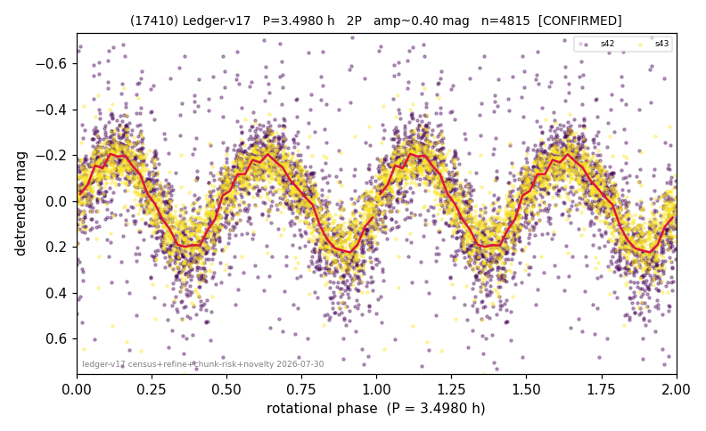

# (17410)

**Adopted:** 3.498 h, 2P, CONFIRMED

<!-- AUTO:START (regenerated from pipeline outputs; do not hand-edit this block) -->
## Evidence (auto)

Detected in 2 sector(s):

| sector | N | baseline (h) | P_phot (h) | power | FAP | cycles | flags |
|--|--|--|--|--|--|--|--|
| s42 | 2649 | 589.5 | 1.7493 | 0.477 | 0.0e+00 | 337.0 | star-cleaned:28,2P-ambiguous |
| s43 | 2214 | 586.4 | 1.7479 | 0.606 | 0.0e+00 | 335.5 | 2P-ambiguous |

- Pipeline refine said: **2P** (folded amp_fourier 0.435); flags: sick-dips-excised:s42(24),s43(2);near-threshold:0.44
- DIA (de-comb): survived(dPW=+5%,R2=0.45,s43@1.749h,2sec)
- Coverage: **2 sector(s)**, best sector covers **168.54 cycles** of the adopted period. Measured periodogram peak width 0% of the period, i.e. about **+/- 0.00195 h** (1 sigma); the decimal places in the adopted value are not a precision claim.
- Factor of two: **adopted on the amplitude convention**: standard practice for an elongated body, but a convention rather than a measurement.
- Gates: FAP<1e-3 and power>=0.10 per detecting sector; >=2 sectors agree (harmonic-aware).
- Adopted shape: **2P** (folded-amplitude rule; pipeline agrees).

### Why this row reads the way it does

- 2 sector(s) detecting
- cross-sector fold correlation 0.99
- doubling BY CONVENTION: amplitude rule on folded amp 0.435 mag, not individually audited

<!-- AUTO:END -->
