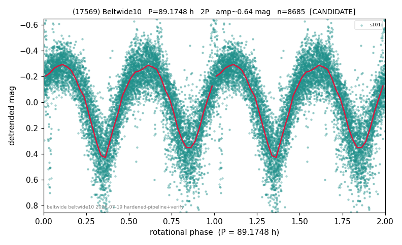

# (17569)

**Adopted:** 89.1748 h, 2P, CONFIRMED

<!-- AUTO:START (regenerated from pipeline outputs; do not hand-edit this block) -->
## Evidence (auto)

Detected in 1 sector(s):

| sector | N | baseline (h) | P_phot (h) | power | FAP | cycles | flags |
|--|--|--|--|--|--|--|--|
| s101 | 8716 | 615.9 | 44.5874 | 0.7002 | 0.0e+00 | 13.8 | 2P-ambiguous |

- Pipeline refine said: **2P** (folded amp_fourier 0.665); flags: sick-dips-excised:s101(31)
- DIA (de-comb): survived_v2(ret=0.987[0.98-1.00],s101@44.587h)
- Coverage: **1 sector(s)**, best sector covers **6.91 cycles** of the adopted period. Measured periodogram peak width 6% of the period, i.e. about **+/- 1.193 h** (1 sigma); the decimal places in the adopted value are not a precision claim.
- Factor of two: **adopted on the amplitude convention**: standard practice for an elongated body, but a convention rather than a measurement.
- Gates: FAP<1e-3 and power>=0.10 per detecting sector; >=2 sectors agree (harmonic-aware).
- Adopted shape: **2P** (folded-amplitude rule; pipeline agrees).

### Why this row reads the way it does

- folded_amp=0.723. Single-sector s101 SLOW just under 100h DOA line -> CANDIDATE cap; amp 0.72>0.40 -> 2P; decomb survived. REVIEW-FLAG: needs 2nd sector; borderline-DOA.
- PROMOTED CANDIDATE->CONFIRMED 2026-08-15 (TESS+ZTF joint, the user-blessed pathway): independent ZTF blind Lomb-Scargle over 6.5 yr / 415 g+r points recovers 44.4429 h = TESS-P/2 44.5874h to 0.32%, power 0.752, trials-corrected FAP 1.3e-119, beating every alias/comb candidate (alias 15.6020h at 0.679); a ZTF detection cannot be a TESS comb tooth or TESS red noise, so this is a genuine second realization and the single-sector ceiling no longer applies

<!-- AUTO:END -->
