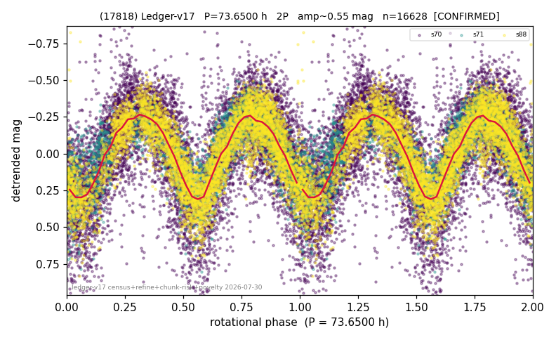

# (17818)

**Adopted:** 73.65 h, 2P, CONFIRMED

<!-- AUTO:START (regenerated from pipeline outputs; do not hand-edit this block) -->
## Evidence (auto)

Detected in 3 sector(s):

| sector | N | baseline (h) | P_phot (h) | power | FAP | cycles | flags |
|--|--|--|--|--|--|--|--|
| s70 | 8184 | 589.3 | 36.7463 | 0.3572 | 0.0e+00 | 16.0 | star-cleaned:146,2P-ambiguous |
| s71 | 2788 | 198.3 | 36.8246 | 0.6226 | 0.0e+00 | 5.4 | 2P-ambiguous |
| s88 | 5763 | 412.7 | 36.8919 | 0.6635 | 0.0e+00 | 11.2 | star-cleaned:15,2P-ambiguous |

- Pipeline refine said: **2P** (folded amp_fourier 0.606); flags: amp-from-clean-sectors(ignored s70);near-comb(amp-cleared):n=9;gap-alias-risk:53h;sick-dip
- DIA (de-comb): survived(dPW=+1%,R2=0.04,s88@36.825h,6sec)
- Coverage: **3 sector(s)**, best sector covers **8.0 cycles** of the adopted period. Measured periodogram peak width 5% of the period, i.e. about **+/- 0.82 h** (1 sigma); the decimal places in the adopted value are not a precision claim.
- Factor of two: **adopted on the amplitude convention**: standard practice for an elongated body, but a convention rather than a measurement.
- Gates: FAP<1e-3 and power>=0.10 per detecting sector; >=2 sectors agree (harmonic-aware).
- Adopted shape: **2P** (folded-amplitude rule; pipeline agrees).

### Why this row reads the way it does

- 3 sector(s) detecting
- cross-sector fold correlation 0.98
- doubling BY CONVENTION: amplitude rule on folded amp 0.606 mag, not individually audited
- chunked sectors flagged (SUPPRESSED;direct-sector-supported) but a directly extracted sector carries the period

<!-- AUTO:END -->
