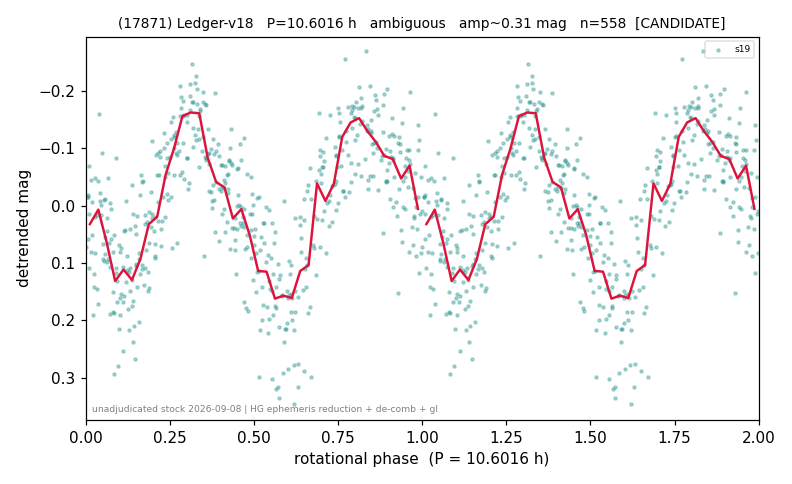

# (17871)

**Adopted:** 10.6016 h, ambiguous, CANDIDATE

<!-- AUTO:START (regenerated from pipeline outputs; do not hand-edit this block) -->
## Evidence (auto)

Detected in 1 sector(s):

| sector | N | baseline (h) | P_phot (h) | power | FAP | cycles | flags |
|--|--|--|--|--|--|--|--|
| s19 | 559 | 417.0 | 5.2984 | 0.5405 | 3.3e-90 | 78.7 | 2P-ambiguous |

- DIA (de-comb): survived (verdict from a dedicated pass recorded in catalog/evidence.csv; this lot's refine output has no row for this object)
- Coverage: **1 sector(s)**, best sector covers **39.33 cycles** of the adopted period. Measured periodogram peak width 3% of the period, i.e. about **+/- 0.1135 h** (1 sigma); the decimal places in the adopted value are not a precision claim.
- Factor of two: **undecided**. The fold at the photometric period does not settle whether it or twice it is the rotation period, and the calibrated test of METHODOLOGY 3b-bis is silent. The photometric period is the published one and twice it is equally allowed.
- Gates: FAP<1e-3 and power>=0.10 per detecting sector; single strong sector (candidate ceiling).
- Adopted shape: **ambiguous** (folded-amplitude rule; pipeline agrees).

### Why this row reads the way it does

- doubling: ambiguous, P1 = 10.6016 h is published and 2 x P1 = 21.2032 h remains equally possible; the fold at P1 shows 2 prominent maxima stable in 100 per cent of the block bootstraps, the folded amplitude 0.291 mag is below the 0.40 cut and the calibrated test is silent (p_emp 0.206 and 0.160 on 20,000 null realisations)
- promoted by hand: s19 has too few points for the automatic half-split, so the four time-quarters were used and give 10.557, 10.557, 5.301 and 5.290 h, that is the period twice and its half twice
- verified outside the standard census pipeline (HG ephemeris reduction, single global cubic trend, trend-degree and time-half stability, de-comb): docs/results/nuovi_periodi_20260908.md and docs/results/doubling_calibrated.md

<!-- AUTO:END -->

## Why this object arrives only now
Its light curve came out of the ledger lot v18, extracted for the slow-rotator rate study
rather than for the catalog. The catalog was frozen on 2026-08-24 for the method and
catalog paper, before those lots had been adjudicated object by object, so a stock of
measured but unarbitrated periods sat outside it. This object is one of fourteen taken
out of that stock on 2026-09-08, verified, and admitted here.

## Why the per-sector table above does not show the adopted period
The AUTO block reports the **census** pass, which detrends each sector with its own
polynomial and searches sector by sector. This object was re-derived from scratch in the
2026-09-08 adjudication with a different and physically stronger reduction, so the two
sets of numbers are not meant to agree digit by digit; the adopted value is the
re-derived one. The full procedure and its per-object output are in
`docs/results/nuovi_periodi_20260908.md` and `docs/results/nuovi_periodi_20260908.csv`
in the working repository, and the doubling adjudication in
`docs/results/doubling_calibrated.md`.

## How it was verified

Not by the standard census gates alone. Each of the fourteen went through the same
battery, listed here with this object's numbers.

1. **Physical reduction.** JPL Horizons ephemerides from the TESS viewpoint (centre
   500@-95), then reduced magnitude with the HG phase function at G = 0.15, which
   removes distance and phase angle physically instead of absorbing them into a
   per-sector polynomial. Outliers rejected at 5 sigma from the robust median
   (1 points).
2. **One global trend, not one per sector.** A single cubic plus two harmonics over
   the whole 417 h baseline, with the period search capped at
   baseline/8, that is at least eight rotations inside the data.
   Photometric period P1 = 10.6016 h, chi-squared gain 56.7 per cent.
3. **Stability against the trend degree.** The same search at polynomial degree 2, 3
   and 4 returns the same period (spread 0.0 per cent).
4. **Independent subsets.** The two time halves of s19 hold too few points for the
   automatic test, so the four time quarters were used instead: 10.557, 10.557,
   5.301 and 5.290 h, that is the period twice and half the period twice. This is
   a hand promotion and is declared as one.
5. **De-comb.** TESS orbits in 328.8 h, so any periodogram has excess power at the
   teeth 328.8/n. Verdict for this object: **survived** (power change +2%, model
   R2 = 0.08).
   The photometric period falls at n >= 13, where adjacent teeth are closer
   together than any period can be separated from them, so tooth proximity carries
   no information here.

## What the coverage really is
**One detecting sector (s19).** The coherence test is therefore between
halves or quarters of the same sector, which share the same systematics. That is
weaker than agreement between sectors observed months apart, and it is the reason
this entry is CANDIDATE and not CONFIRMED.

## The factor of two

Decided with the **calibrated** test of METHODOLOGY 3b-bis, not with the nominal
odd-harmonic F test. That test was validated on 174 external LCDB labels in the same
pass and found **not calibrated**: it declares a doubling for 44 of the 62 objects
whose published period equals our photometric period, specificity 0.290. Its nominal
p-values are not quoted anywhere in this entry. The calibrated replacement draws its
significance from a block bootstrap under the single-peaked hypothesis, 20,000
realisations at two block lengths.

| quantity at P1 = 10.6016 h | value |
|--|--|
| calibrated p, 1 d blocks | 0.20619 |
| calibrated p, 2 d blocks | 0.15984 |
| unequal minima, z above the null mean | +0.27 |
| prominent maxima in the fold (stability) | 2 (100 per cent) |
| folded amplitude at P1 | 0.291 mag |

**Ambiguous, and published as such.** The photometric period 10.6016 h is the
published value and **2 x P1 = 21.2032 h remains exactly as possible**: nothing
in the data prefers one over the other. The calibrated test is silent, the minima
do not differ significantly, and the fold topology does not settle it either
(2 prominent maxima, stable in 100 per cent of the
bootstraps, which reads as P1 already being the rotation period, but with no
support from either of the other two criteria).

## Novelty
Checked on **both** gates together on 2026-09-08, the LCDB 2023 summary **and** the
SsODNet `ssoCard` spins field: neither carries a rotation period for this object
(`docs/results/gap_hunt_20260905.md`, `novel_both_gates_20260908.csv` in the working
repository). One gate is not enough in either direction: of 72 objects SsODNet
reported without a spin, 36 already had an LCDB period, and three objects of the same
sweep are absent from the LCDB summary but carry an SsODNet spin. This is a first
determination on both.

## Verdict
CANDIDATE ambiguous / 10.6016 h. The alias 2 x P1 = 21.2032 h is equally possible and neither is preferred.
