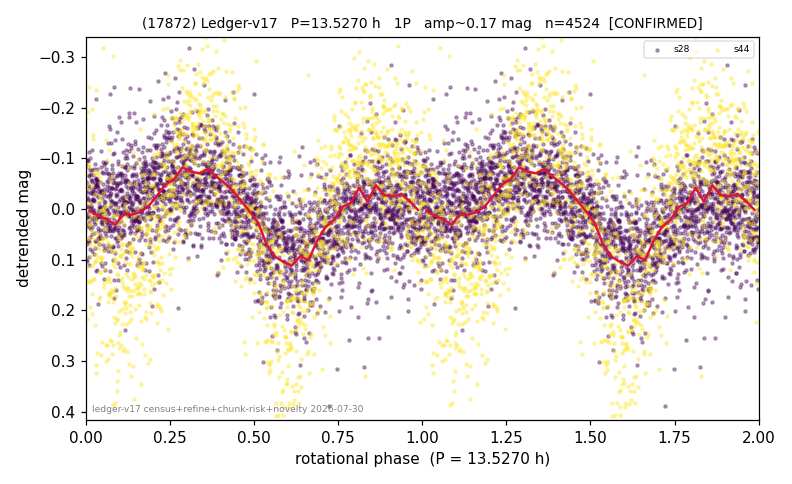

# (17872)

**Adopted:** 13.527 h, 1P, CONFIRMED

<!-- AUTO:START (regenerated from pipeline outputs; do not hand-edit this block) -->
## Evidence (auto)

Detected in 2 sector(s):

| sector | N | baseline (h) | P_phot (h) | power | FAP | cycles | flags |
|--|--|--|--|--|--|--|--|
| s28 | 2892 | 598.2 | 13.5347 | 0.2087 | 2.0e-142 | 44.2 | 2P-ambiguous |
| s44 | 1648 | 402.3 | 6.7597 | 0.4815 | 3.0e-230 | 59.5 | star-cleaned:14,2P-ambiguous |

- Pipeline refine said: **1P** (folded amp_fourier 0.119); flags: sick-dips-excised:s44(3);harmonic-only-agreement:s44(pw=0.01);period-spread:67%
- DIA (de-comb): survived(dPW=+10%,R2=0.14,s44@6.763h,3sec)
- Gates: FAP<1e-3 and power>=0.10 per detecting sector; >=2 sectors agree (harmonic-aware).
- Adopted shape: **1P** (folded-amplitude rule; pipeline agrees).

### Why this row reads the way it does

- 2 sector(s) detecting
- cross-sector fold correlation 0.58
- single-peaked at folded amp 0.119 mag
- pipeline flag: harmonic-only-agreement

<!-- AUTO:END -->
