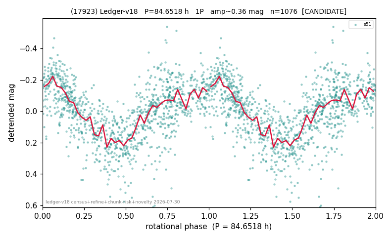

# (17923)

**Adopted:** 84.6518 h, 1P, CONFIRMED

<!-- AUTO:START (regenerated from pipeline outputs; do not hand-edit this block) -->
## Evidence (auto)

Detected in 2 sector(s):

| sector | N | baseline (h) | P_phot (h) | power | FAP | cycles | flags |
|--|--|--|--|--|--|--|--|
| s32 | 2037 | 464.5 | 85.9496 | 0.595 | 0.0e+00 | 5.4 | 2P-ambiguous |
| s51 | 1100 | 569.0 | 84.6518 | 0.4171 | 1.5e-124 | 6.7 | star-cleaned:49,2P-ambiguous |

- Pipeline refine said: **1P** (folded amp_fourier 0.397); flags: near-comb(amp-cleared):n=4;few-cycle:3.4;sick-dips-excised:s51(18);near-threshold:0.40
- DIA (de-comb): survived(dPW=+3%,R2=0.08,s51@84.652h,1sec)
- Coverage: **2 sector(s)**, best sector covers **6.72 cycles** of the adopted period. Measured periodogram peak width 14% of the period, i.e. about **+/- 5.134 h** (1 sigma); the decimal places in the adopted value are not a precision claim.
- Factor of two: no doubling was applied.
- Gates: FAP<1e-3 and power>=0.10 per detecting sector; >=2 sectors agree (harmonic-aware).
- Adopted shape: **1P** (folded-amplitude rule; pipeline agrees).

### Why this row reads the way it does

- 1 sector(s) detecting
- single-peaked at folded amp 0.397 mag
- pipeline flag: few-cycle
- s32 crowding-rescued (2026-08-08, |b| 5-15 deg rescue, 5-point crowding penalty, 72 vs 77 per cent LCDB agreement): power 0.57, FAP 0.0e+00 at the adopted photometric period, 5.5 cycles, direct
- PROMOTED CANDIDATE->CONFIRMED: second independent detecting sector passes the per-sector gates; single-sector ceiling no longer applies

<!-- AUTO:END -->
