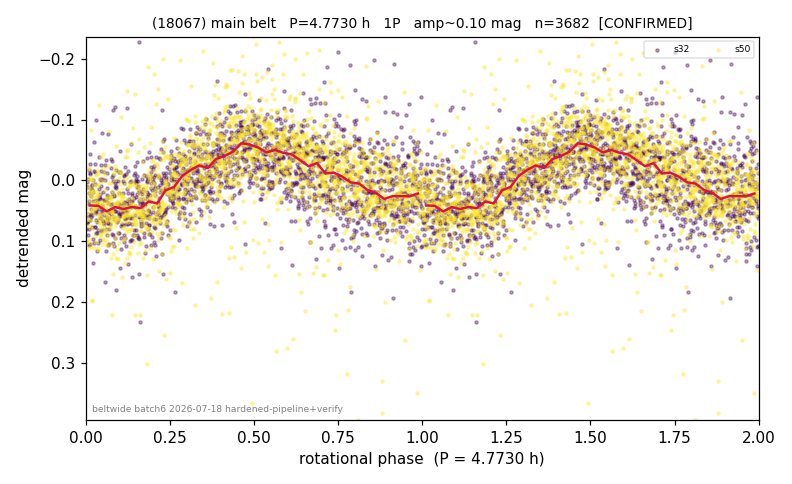

# (18067)

**Adopted:** 9.546 h, 2P, CONFIRMED

<!-- AUTO:START (regenerated from pipeline outputs; do not hand-edit this block) -->
## Evidence (auto)

Detected in 2 sector(s):

| sector | N | baseline (h) | P_phot (h) | power | FAP | cycles | flags |
|--|--|--|--|--|--|--|--|
| s32 | 1716 | 384.8 | 4.771 | 0.2563 | 5.0e-106 | 80.7 | star-cleaned:10 |
| s50 | 1975 | 607.0 | 4.7743 | 0.2527 | 1.7e-120 | 127.1 | star-cleaned:14 |

- Pipeline refine said: **1P** (folded amp_fourier 0.123); flags: sick-dips-excised:s50(3)
- DIA (de-comb): survived_v2(ret=1.001[1.00-1.00],s32@4.773h)
- Coverage: **2 sector(s)**, best sector covers **127.18 cycles** of the adopted period. Measured periodogram peak width 1% of the period, i.e. about **+/- 0.01384 h** (1 sigma); the decimal places in the adopted value are not a precision claim.
- Factor of two: no doubling was applied.
- Gates: FAP<1e-3 and power>=0.10 per detecting sector; >=2 sectors agree (harmonic-aware).
- **Adopted shape 2P OVERRIDES the pipeline's 1P** (doubling audit 2026-07-25: folded amplitude >= 0.25 mag, so a single-peaked curve is physically implausible; Harris convention -> 2P. The census 3-test doubling logic was measured at only 30% recall against 289 LCDB U>=2 ground-truth periods).

### Why this row reads the way it does

- folded_amp=0.09. Both sectors independently find P=4.773-4.774h at very high significance (FAP~1e-106 s32, 1e-178 s50-after-clean); the "sector-dropped:s50(range>3mag)" flag traces to ~48 non-astrophysical faint outlier points
- DOUBLING CORRECTED 2026-08-30: adopted period doubled from 4.773 h. The previous value came from the folded-amplitude rule, which was found biased low (9 of 9 disagreements with MPB 2024-2026 in the same direction). Odd-harmonic test at the long period gives z1=10.23 with margin 8.13 over non-harmonic multiples 1.7x/2.3x (reference group: 0 of 38 above margin 2).

<!-- AUTO:END -->
